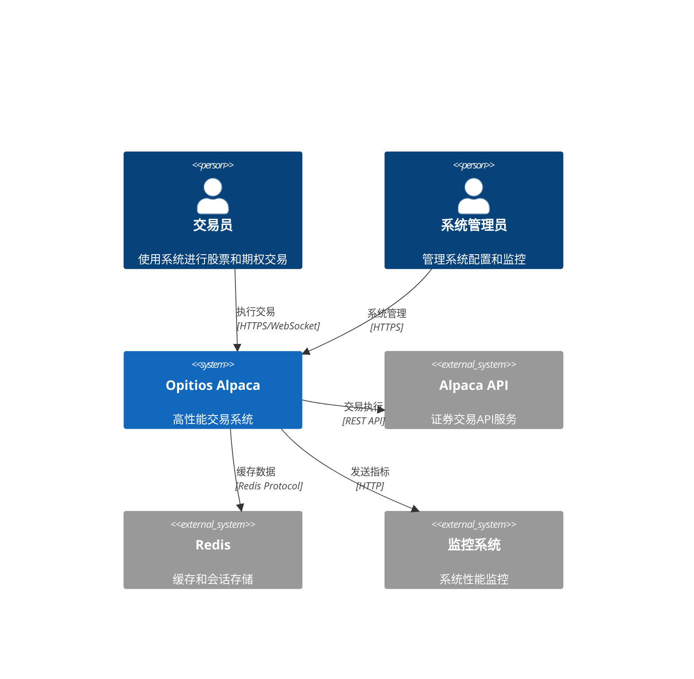
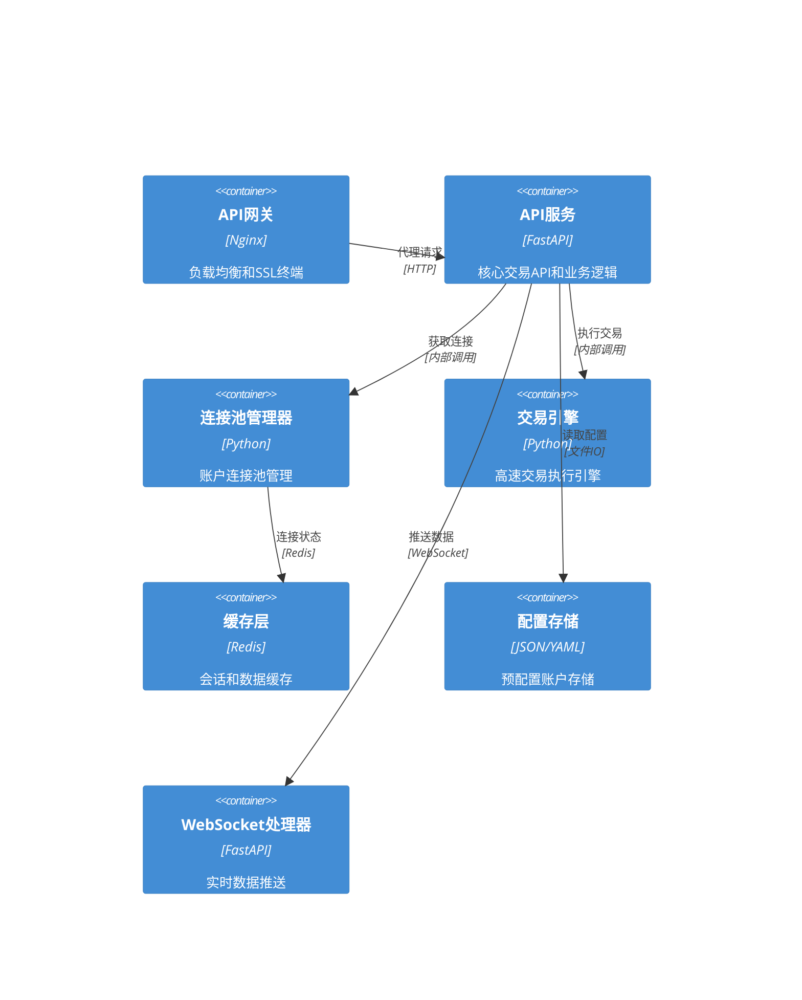
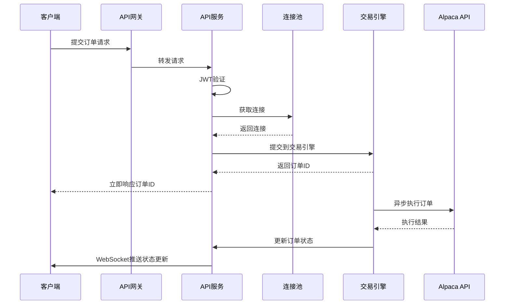
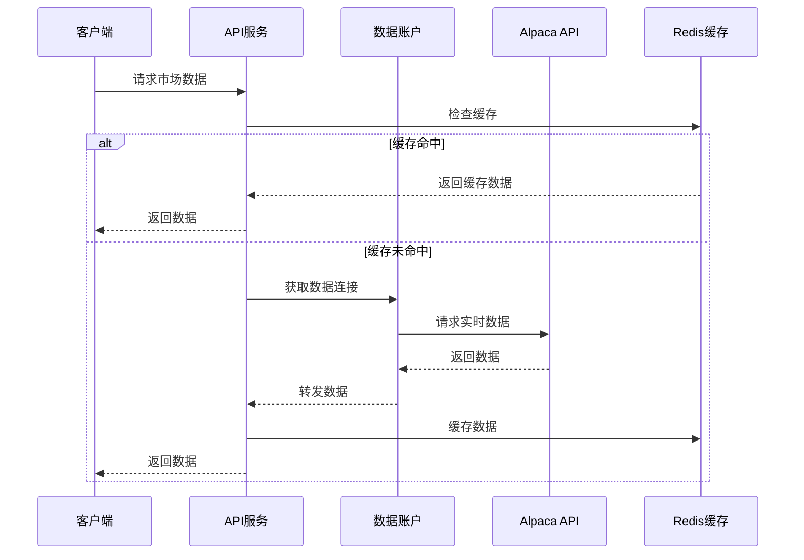

# Opitios Alpaca 系统架构设计

## 执行概要

本文档描述了 Opitios Alpaca 高性能交易系统的架构设计，该系统专为支持1000个并发账户的零延迟交易而优化。系统移除了复杂的用户管理模块，采用预配置账户连接池和主账户分离架构，确保最佳的交易执行性能。

## 系统概览

### 系统上下文图



### 容器架构图



## 核心架构设计

### 1. 简化认证架构

#### 移除组件
- **用户管理模块** (`user_manager.py`) - 完全移除
- **认证路由** (`auth_routes.py`) - 完全移除
- **复杂权限系统** - 简化为基础JWT验证

#### 新增JWT中间件
```python
class SimplifiedJWTMiddleware:
    """简化的JWT验证中间件"""
    
    def __init__(self):
        self.jwt_secret = settings.jwt_secret
        self.jwt_algorithm = "HS256"
        
    async def validate_token(self, token: str) -> dict:
        """验证JWT token并返回账户ID"""
        try:
            payload = jwt.decode(token, self.jwt_secret, algorithms=[self.jwt_algorithm])
            return {
                "account_id": payload["account_id"],
                "account_type": payload.get("account_type", "trading"),
                "permissions": payload.get("permissions", ["trade", "market_data"])
            }
        except jwt.ExpiredSignatureError:
            raise HTTPException(status_code=401, detail="Token expired")
        except jwt.JWTError:
            raise HTTPException(status_code=401, detail="Invalid token")
```

### 2. 预配置账户连接池架构

#### 账户配置系统
```yaml
# accounts_config.yaml
accounts:
  - account_id: "ACC001"
    account_type: "master"
    alpaca_credentials:
      api_key: "encrypted_key_1"
      secret_key: "encrypted_secret_1"
      paper_trading: false
    connection_pool:
      max_connections: 10
      priority: "high"
      
  - account_id: "ACC002" 
    account_type: "trading"
    alpaca_credentials:
      api_key: "encrypted_key_2"
      secret_key: "encrypted_secret_2"
      paper_trading: false
    connection_pool:
      max_connections: 5
      priority: "normal"
```

#### 优化连接池管理器
```python
class OptimizedConnectionPool:
    """优化的连接池管理器，支持1000并发账户"""
    
    def __init__(self):
        self.account_pools: Dict[str, AccountPool] = {}
        self.connection_cache = ConnectionCache(max_size=2000)
        self.load_balancer = ConnectionLoadBalancer()
        
    async def initialize_pools(self):
        """初始化所有账户连接池"""
        accounts_config = load_accounts_config()
        
        for account_config in accounts_config:
            pool = AccountPool(
                account_id=account_config["account_id"],
                credentials=account_config["alpaca_credentials"],
                max_connections=account_config["connection_pool"]["max_connections"],
                priority=account_config["connection_pool"]["priority"]
            )
            await pool.pre_warm_connections()
            self.account_pools[account_config["account_id"]] = pool
            
    async def get_connection(self, account_id: str) -> AlpacaConnection:
        """获取账户连接，零延迟设计"""
        # 1. 尝试从缓存获取
        cached_conn = self.connection_cache.get(account_id)
        if cached_conn and cached_conn.is_healthy():
            return cached_conn
            
        # 2. 从连接池获取
        pool = self.account_pools.get(account_id)
        if not pool:
            raise AccountNotConfiguredError(f"Account {account_id} not configured")
            
        connection = await pool.acquire_connection()
        self.connection_cache.put(account_id, connection)
        return connection
```

### 3. 主账户与交易账户分离架构

#### 账户类型设计
```python
class AccountType(Enum):
    MASTER = "master"      # 主账户：资金管理、风控
    TRADING = "trading"    # 交易账户：执行交易
    MARKET_DATA = "data"   # 数据账户：获取市场数据
    BACKUP = "backup"      # 备用账户：故障转移

class AccountManager:
    """账户管理器"""
    
    def __init__(self):
        self.master_accounts = []
        self.trading_accounts = []
        self.data_accounts = []
        self.backup_accounts = []
        
    async def route_request(self, request_type: str, account_id: str):
        """请求路由到合适的账户类型"""
        if request_type in ["balance", "portfolio", "risk_check"]:
            return await self.get_master_account(account_id)
        elif request_type in ["order", "position"]:
            return await self.get_trading_account(account_id)
        elif request_type in ["quote", "bars", "trades"]:
            return await self.get_data_account(account_id)
```

### 4. 零延迟交易系统架构

#### 交易引擎设计
```python
class ZeroLatencyTradeEngine:
    """零延迟交易引擎"""
    
    def __init__(self):
        self.order_queue = AsyncQueue(maxsize=10000)
        self.connection_pool = OptimizedConnectionPool()
        self.execution_workers = []
        self.pre_validation_cache = {}
        
    async def initialize(self):
        """初始化交易引擎"""
        # 预热连接池
        await self.connection_pool.initialize_pools()
        
        # 启动执行工作线程
        for i in range(20):  # 20个并发执行器
            worker = TradeExecutionWorker(
                worker_id=i,
                connection_pool=self.connection_pool,
                order_queue=self.order_queue
            )
            self.execution_workers.append(worker)
            asyncio.create_task(worker.start())
            
    async def submit_order(self, order: OrderRequest) -> OrderResponse:
        """提交订单，零延迟设计"""
        # 1. 预验证（缓存结果）
        validation_key = f"{order.account_id}:{order.symbol}"
        if validation_key not in self.pre_validation_cache:
            await self.pre_validate_order(order)
            
        # 2. 立即返回订单ID
        order_id = generate_order_id()
        
        # 3. 异步执行
        await self.order_queue.put({
            "order_id": order_id,
            "order": order,
            "timestamp": time.time_ns()
        })
        
        return OrderResponse(
            order_id=order_id,
            status="submitted",
            submitted_at=datetime.utcnow()
        )
```

### 5. 高并发支持架构

#### 并发优化策略
```python
class ConcurrencyManager:
    """并发管理器，支持1000并发账户"""
    
    def __init__(self):
        # 连接池配置
        self.max_total_connections = 2000
        self.max_connections_per_account = 5
        self.connection_timeout = 30
        
        # 限流配置
        self.global_rate_limit = 10000  # 每秒10000请求
        self.per_account_rate_limit = 100  # 每账户每秒100请求
        
        # 负载均衡
        self.load_balancer = RoundRobinBalancer()
        
    async def handle_request(self, request: Request) -> Response:
        """处理请求，确保高并发性能"""
        # 1. 获取账户连接
        connection = await self.get_available_connection(request.account_id)
        
        # 2. 执行请求
        try:
            response = await connection.execute(request)
            return response
        finally:
            await self.release_connection(connection)
```

## 组件详细设计

### 1. API网关层
**技术**: Nginx + FastAPI
**功能**:
- SSL终端
- 负载均衡
- 请求路由
- 静态文件服务

### 2. 认证中间件
**技术**: JWT + Redis缓存
**功能**:
- Token验证
- 账户ID提取
- 权限检查
- 缓存验证结果

### 3. 连接池管理器
**技术**: AsyncIO + Redis
**功能**:
- 连接预热
- 健康检查
- 负载均衡
- 故障转移

### 4. 交易引擎
**技术**: AsyncIO + Queue
**功能**:
- 订单排队
- 并发执行
- 实时监控
- 错误处理

### 5. 缓存层
**技术**: Redis Cluster
**功能**:
- 连接状态缓存
- 市场数据缓存
- 会话缓存
- 限流计数器

## 数据流设计

### 交易请求流程


### 市场数据流程


## 性能优化策略

### 1. 连接复用
- 预热连接池
- 长连接保持
- 智能负载均衡

### 2. 缓存策略
- 多级缓存
- 预加载热点数据
- 异步更新

### 3. 并发处理
- 异步IO
- 连接池隔离
- 队列缓冲

### 4. 监控告警
- 实时性能监控
- 自动故障转移
- 预警系统

## 部署架构

### 生产环境配置
```yaml
deployment:
  api_servers: 3
  connection_pool_size: 2000
  redis_cluster: 3
  nginx_workers: 8
  
scaling:
  auto_scaling: true
  min_instances: 2
  max_instances: 10
  cpu_threshold: 70%
  
monitoring:
  prometheus: true
  grafana: true
  alertmanager: true
```

## 架构决策记录 (ADRs)

### ADR-001: 移除用户管理模块
**状态**: 已接受
**背景**: 现有用户管理模块过于复杂，影响交易性能
**决策**: 完全移除用户管理，采用预配置账户
**影响**: 简化架构，提升性能，降低维护成本

### ADR-002: 采用预配置账户连接池
**状态**: 已接受
**背景**: 需要支持1000并发账户的高性能交易
**决策**: 使用预配置账户和连接池预热
**影响**: 显著提升并发性能，减少连接建立延迟

### ADR-003: 主账户与交易账户分离
**状态**: 已接受
**背景**: 不同操作类型对账户的要求不同
**决策**: 按功能分离不同类型的账户
**影响**: 提升系统稳定性，优化资源利用

### ADR-004: 零延迟交易引擎
**状态**: 已接受
**背景**: 交易系统需要极低的延迟
**决策**: 采用异步处理和预验证机制
**影响**: 大幅降低交易延迟，提升用户体验

## 系统限制

### 并发限制
- 最大并发账户: 1000
- 每账户最大连接数: 5
- 全局连接池上限: 2000

### 性能指标
- API响应时间: < 50ms
- 订单执行延迟: < 100ms
- 系统可用性: 99.9%

### 资源要求
- CPU: 16核心
- 内存: 32GB
- 存储: SSD 500GB
- 网络: 1Gbps

## 未来扩展考虑

### 1. 微服务架构
当系统需要进一步扩展时，可以拆分为：
- 认证服务
- 交易服务
- 数据服务
- 监控服务

### 2. 数据库支持
如需持久化存储，可以添加：
- PostgreSQL（关系数据）
- InfluxDB（时序数据）
- MongoDB（文档数据）

### 3. 多云部署
支持多云环境部署：
- AWS
- Google Cloud
- Azure
- 私有云

这个架构设计确保了系统的高性能、高可用性和可扩展性，同时简化了复杂性，专注于核心的交易功能。