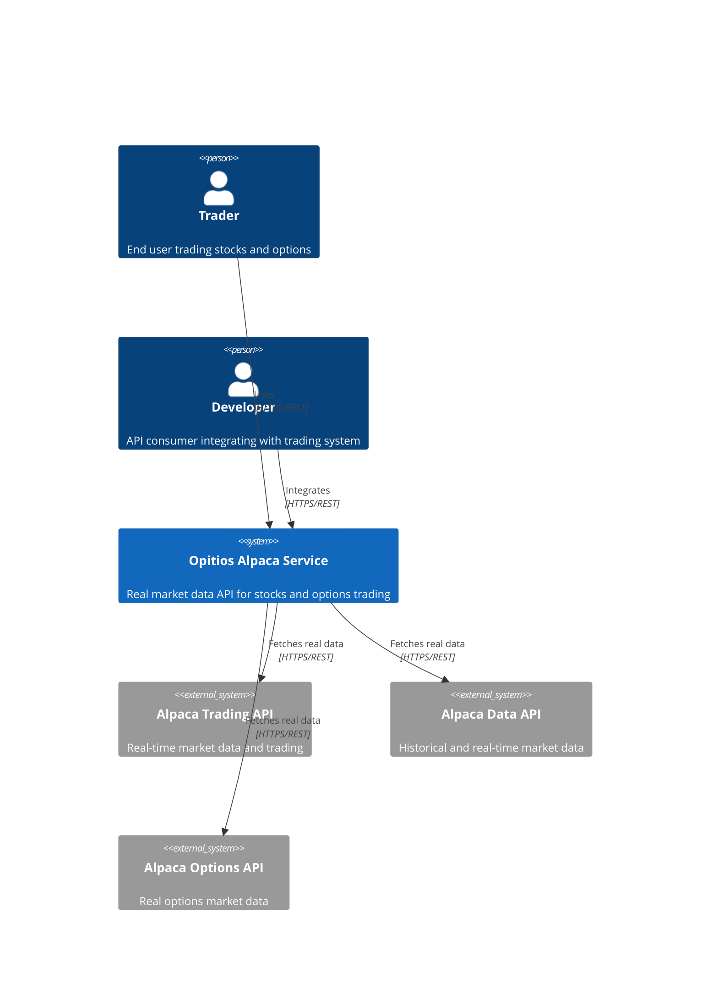
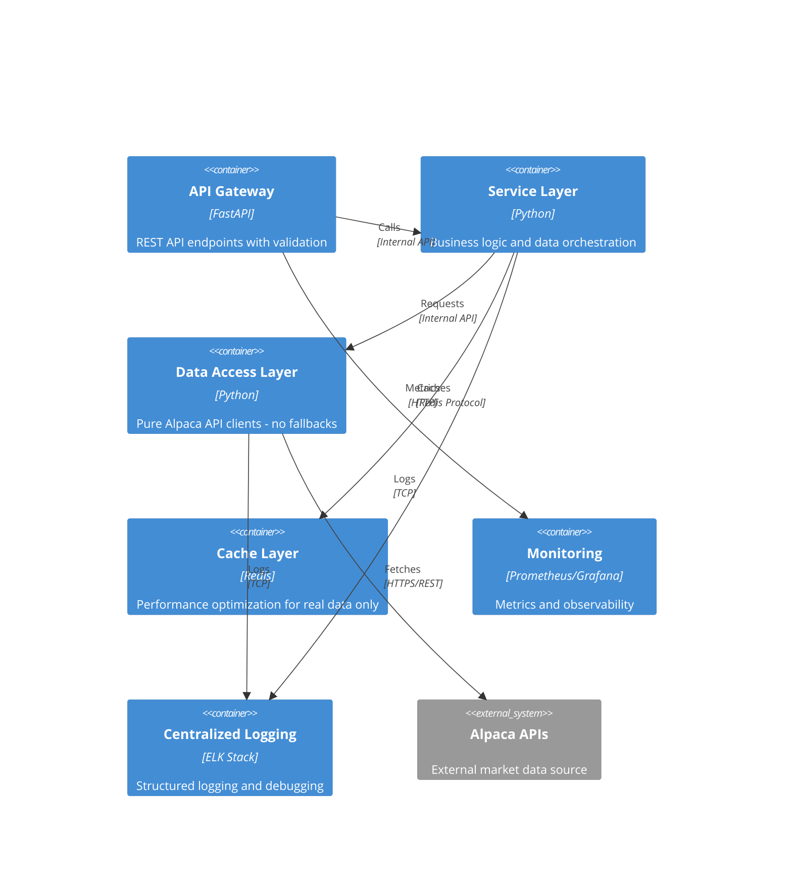
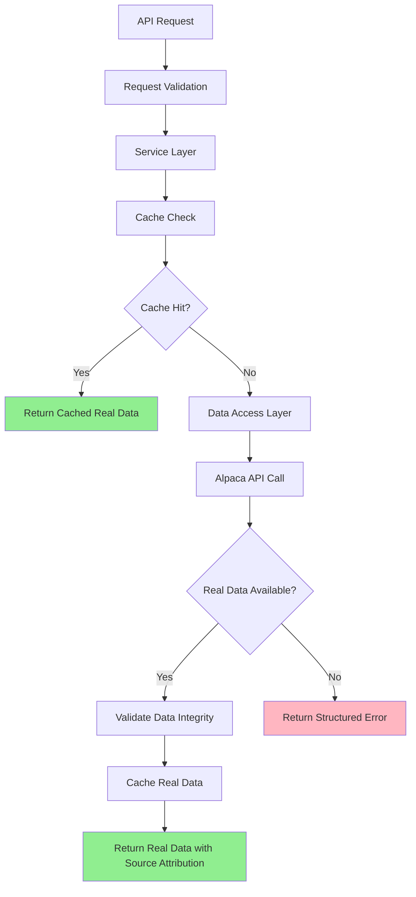

# System Architecture - Real Market Data Only

## Executive Summary

This document defines the architectural redesign of the opitios_alpaca service to eliminate all mock/calculated data and ensure 100% real market data usage. The new architecture implements a strict real-data-only policy with comprehensive error handling for scenarios where market data is unavailable.

## Current Architecture Issues

### Identified Mock Data Sources
1. **Black-Scholes Fallback Calculations** (alpaca_client.py:274-323)
   - Theoretical option pricing when real Alpaca data unavailable
   - Hardcoded Greeks: gamma (0.05), theta (-0.02), vega (0.1)
   - Calculated intrinsic and time values
   - Mock implied volatility (0.25)

2. **Data Source Mixing**
   - Real Alpaca data mixed with calculated fallbacks in same response
   - Inconsistent data source attribution
   - No clear indication when data is calculated vs real

3. **Inconsistent Error Handling**
   - Silent fallback to calculations instead of proper error responses
   - No structured error format for missing data scenarios

## Architecture Overview

### System Context


### Container Diagram


## Technology Stack

### Core Framework
- **Runtime**: Python 3.11+
- **Web Framework**: FastAPI 0.104+
- **Async**: asyncio with async/await patterns
- **HTTP Client**: aiohttp for Alpaca API calls
- **Data Models**: Pydantic v2 for validation

### External Dependencies
- **Market Data**: Alpaca Trading API (real data only)
- **Caching**: Redis for performance optimization
- **Monitoring**: Prometheus + Grafana
- **Logging**: structlog + ELK Stack

### Development Tools
- **Testing**: pytest + pytest-asyncio
- **Code Quality**: black, flake8, mypy
- **Documentation**: FastAPI auto-docs + MkDocs
- **CI/CD**: GitHub Actions

## Component Design

### 1. Data Access Layer (Pure Alpaca Clients)

**Purpose**: Direct interface to Alpaca APIs with zero fallback logic
**Technology**: Python asyncio + aiohttp
**Key Principle**: Fail fast when real data unavailable

```python
class PureAlpacaDataClient:
    """Pure Alpaca API client - no calculations or fallbacks"""
    
    async def get_stock_quote(self, symbol: str) -> RealMarketData | DataUnavailableError
    async def get_option_quote(self, symbol: str) -> RealOptionsData | DataUnavailableError  
    async def get_options_chain(self, symbol: str) -> RealOptionsChain | DataUnavailableError
```

**Interfaces**:
- Input: Symbol strings, request parameters
- Output: Real market data objects OR structured error responses
- Dependencies: Alpaca API credentials, network connectivity

### 2. Service Layer (Business Logic)

**Purpose**: Data orchestration, validation, and business rules
**Technology**: Python with async patterns
**Key Principle**: Never generate or calculate market data

```python
class MarketDataService:
    """Business logic for market data operations"""
    
    async def get_validated_stock_quote(self, symbol: str) -> ValidatedQuote
    async def get_complete_options_data(self, symbol: str) -> CompleteOptionsData
```

**Interfaces**:
- Input: Business requests with validation
- Output: Validated real data with source attribution
- Dependencies: PureAlpacaDataClient, cache layer, validation rules

### 3. API Layer (FastAPI Routes)

**Purpose**: HTTP request/response handling with comprehensive error responses
**Technology**: FastAPI with Pydantic validation
**Key Principle**: Transparent data source communication

```python
@router.get("/stocks/{symbol}/quote")
async def get_stock_quote(symbol: str) -> StockQuoteResponse | ErrorResponse
```

**Interfaces**:
- Input: HTTP requests with parameter validation
- Output: JSON responses with data source attribution
- Dependencies: Service layer, error handling middleware

## Data Architecture

### Data Flow


### Data Models

#### Real Market Data Response
```python
class RealStockQuote(BaseModel):
    symbol: str
    bid_price: Optional[float]
    ask_price: Optional[float]
    last_price: Optional[float]
    timestamp: datetime
    data_source: Literal["alpaca_real_time"] = "alpaca_real_time"
    data_freshness: timedelta  # Age of data
    market_status: str  # "open", "closed", "pre_market", "after_hours"
```

#### Real Options Data Response
```python
class RealOptionQuote(BaseModel):
    symbol: str
    underlying_symbol: str
    strike_price: float
    expiration_date: date
    option_type: Literal["call", "put"]
    bid_price: Optional[float]
    ask_price: Optional[float]
    last_price: Optional[float]
    volume: Optional[int]
    open_interest: Optional[int]
    timestamp: datetime
    data_source: Literal["alpaca_options_real_time"] = "alpaca_options_real_time"
    data_freshness: timedelta
```

#### Error Response Model
```python
class DataUnavailableError(BaseModel):
    error_code: str  # "REAL_DATA_UNAVAILABLE"
    error_message: str
    error_type: Literal["data_unavailable"]
    request_id: str
    timestamp: datetime
    suggested_action: Optional[str]
    retry_after: Optional[int]  # seconds
```

## Security Architecture

### Authentication & Authorization
- **API Key Authentication**: Alpaca API key management
- **Request Validation**: Input sanitization and validation
- **Rate Limiting**: Prevent API abuse and quota management
- **CORS Configuration**: Restricted origins for production

### Data Integrity Measures
- [ ] Cryptographic verification of API responses
- [ ] Data source attribution on all responses  
- [ ] Timestamp validation for data freshness
- [ ] Request/response logging for audit trails
- [ ] Secure credential storage (environment variables)

## Error Handling Architecture

### Error Categories & Responses

#### 1. Data Unavailable Errors (HTTP 404)
```json
{
    "error_code": "REAL_DATA_UNAVAILABLE", 
    "error_message": "Real market data not available for AAPL240216C00190000",
    "error_type": "data_unavailable",
    "request_id": "req_1234567890",
    "timestamp": "2024-01-15T15:30:00Z",
    "suggested_action": "Try a different expiration date or check if the option contract exists"
}
```

#### 2. API Rate Limiting (HTTP 429)
```json
{
    "error_code": "RATE_LIMIT_EXCEEDED",
    "error_message": "Alpaca API rate limit exceeded",
    "error_type": "rate_limiting", 
    "retry_after": 60,
    "request_id": "req_1234567891"
}
```

#### 3. External Service Errors (HTTP 503)
```json
{
    "error_code": "UPSTREAM_SERVICE_ERROR",
    "error_message": "Alpaca API temporarily unavailable",
    "error_type": "service_unavailable",
    "suggested_action": "Try again in a few minutes",
    "request_id": "req_1234567892"
}
```

### Circuit Breaker Pattern
- Monitor Alpaca API success rates
- Implement circuit breaker for failing endpoints
- Graceful degradation with clear error messages
- Automatic recovery detection

## Performance Architecture

### Caching Strategy
- **Cache Real Data Only**: Never cache calculated values
- **Redis Caching**: Real-time quotes cached for 5-30 seconds
- **Cache Invalidation**: Time-based and event-based invalidation
- **Cache Keys**: Include data source in cache key structure

### Performance Optimization
- **Connection Pooling**: Persistent connections to Alpaca APIs
- **Async Processing**: Non-blocking I/O operations
- **Request Batching**: Batch multiple symbol requests when possible
- **Data Compression**: Compress large responses
- **CDN Integration**: Static asset delivery optimization

### Monitoring Metrics
- **Data Source Success Rate**: % of requests returning real data
- **API Response Times**: Latency tracking by endpoint
- **Cache Hit Rates**: Performance optimization metrics
- **Error Rates**: Tracking by error type and data source

## Scalability Strategy

### Horizontal Scaling
- **Stateless Service Design**: No server-side session state
- **Load Balancing**: Distribute requests across multiple instances  
- **Database Replication**: Read replicas for configuration data
- **Cache Clustering**: Redis cluster for high availability

### Performance Targets
- **API Response Time**: < 100ms for cached data, < 500ms for real-time
- **Throughput**: 1000+ requests/second per instance
- **Availability**: 99.9% uptime excluding Alpaca API issues
- **Data Freshness**: Real-time data within 1 second of market

## Monitoring & Observability

### Key Metrics
- **Real Data Success Rate**: % of requests returning authentic data
- **Data Source Attribution**: Tracking all data origins
- **API Endpoint Performance**: Response times by endpoint
- **Error Distribution**: Breakdown by error type and frequency
- **Cache Performance**: Hit rates and invalidation patterns

### Alerting Strategy
- **Critical**: Real data success rate < 95%
- **Warning**: API response time > 1 second
- **Info**: Cache hit rate < 80%
- **Real-time Dashboards**: Data source health monitoring

### Logging Standards
```json
{
    "timestamp": "2024-01-15T15:30:00Z",
    "request_id": "req_1234567890", 
    "endpoint": "/stocks/AAPL/quote",
    "data_source": "alpaca_real_time",
    "response_time_ms": 125,
    "cache_hit": false,
    "real_data_available": true
}
```

## Deployment Architecture

### Environment Configuration
- **Development**: Paper trading with full debugging
- **Staging**: Production-like with real API testing  
- **Production**: Live trading with monitoring

### Infrastructure Requirements
- **Application Servers**: Docker containers with auto-scaling
- **Cache Infrastructure**: Redis cluster with persistence
- **Monitoring Stack**: Prometheus + Grafana + AlertManager
- **Load Balancer**: Nginx with health checks

### Health Checks
- **Liveness Probe**: Basic service health
- **Readiness Probe**: External dependency health
- **Alpaca API Health**: Regular connectivity tests
- **Data Quality Checks**: Validate data integrity

## Architectural Decisions (ADRs)

### ADR-001: Remove All Calculated Data
**Status**: Accepted
**Context**: Current system uses Black-Scholes calculations as fallback
**Decision**: Remove all calculations, return errors when real data unavailable
**Consequences**: Higher reliability but some requests will fail
**Alternatives Considered**: Flagged calculated data, hybrid approach

### ADR-002: Fail-Fast Error Handling
**Status**: Accepted  
**Context**: Need clear distinction between real and unavailable data
**Decision**: Return structured errors immediately when real data unavailable
**Consequences**: Better user experience, no misleading data
**Alternatives Considered**: Silent failures, cached stale data

### ADR-003: Comprehensive Data Source Attribution
**Status**: Accepted
**Context**: Users need transparency about data origins
**Decision**: Include data_source field in all responses
**Consequences**: Larger response payloads but complete transparency
**Alternatives Considered**: Header-based attribution, metadata endpoints

This architecture ensures 100% real market data usage while maintaining system reliability through comprehensive error handling, monitoring, and performance optimization. The system will never mislead users with calculated or mock data, providing complete transparency about data availability and sources.