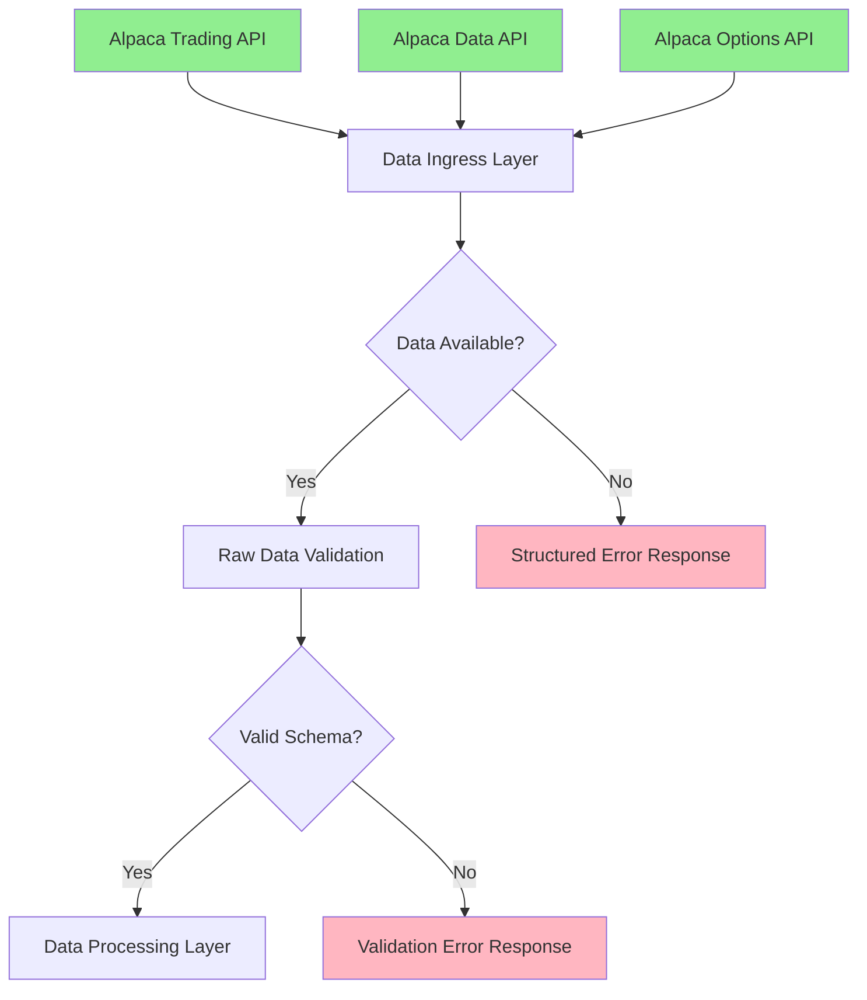
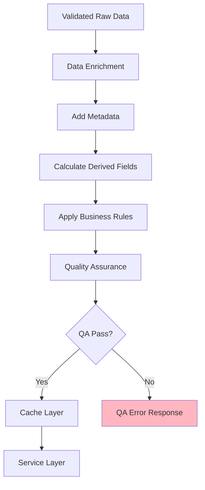
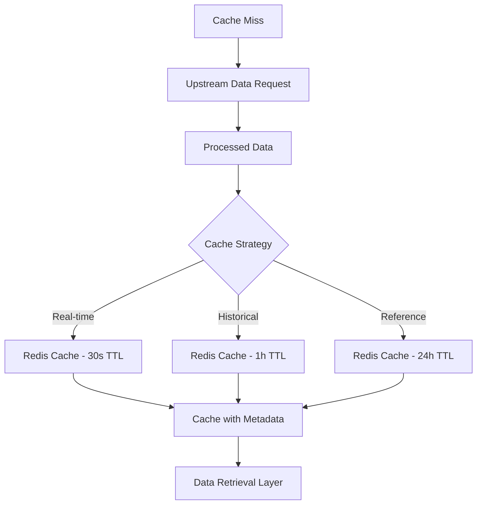
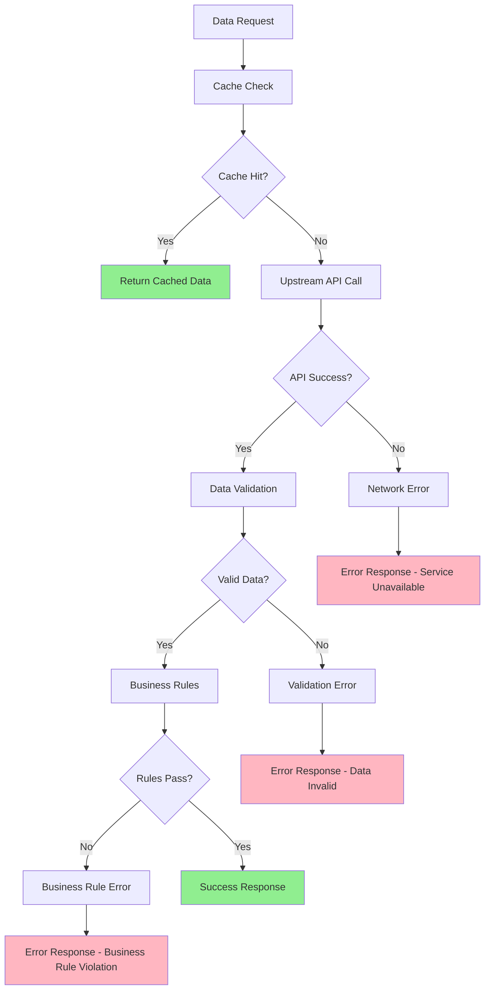

# Data Flow Architecture - Real Market Data Processing

## Overview

This document defines the data flow architecture for processing real market data in the opitios_alpaca service. The design ensures 100% real data usage with comprehensive validation, caching, and error handling at each stage.

## Core Data Flow Principles

### 1. Single Source of Truth
- **Alpaca APIs Only**: No alternative data sources or calculations
- **Data Lineage**: Track data origin throughout the system
- **Immutable Source Data**: Never modify data received from Alpaca
- **Audit Trail**: Log all data access and transformations

### 2. Data Integrity Pipeline
- **Validation at Ingress**: Validate data immediately upon receipt
- **Schema Enforcement**: Strict adherence to expected data structures
- **Freshness Checks**: Reject stale or outdated data
- **Completeness Verification**: Ensure all required fields present

### 3. Fail-Fast Processing
- **Early Validation**: Catch issues at data ingress
- **Structured Errors**: Propagate errors with context
- **No Data Fabrication**: Never fill missing data with calculated values
- **Transparent Failures**: Clear error messages about data availability

## Data Flow Layers

### Layer 1: External Data Sources



**Data Sources**:
- **Alpaca Trading API**: Real-time quotes, account data, orders
- **Alpaca Data API**: Historical bars, market snapshots
- **Alpaca Options API**: Options chains, options quotes

**Data Types**:
- Stock quotes (bid/ask/last prices)
- Options quotes (bid/ask/volume/open interest)
- Historical bars (OHLCV data)
- Options chains (contract listings)
- Account information (positions, balances)

### Layer 2: Data Ingress and Validation

```python
class DataIngressPipeline:
    """Real-time data ingestion with validation"""
    
    async def ingest_stock_quote(self, raw_data: Dict) -> ValidatedStockQuote | DataError:
        """
        1. Receive raw data from Alpaca API
        2. Validate data schema and completeness
        3. Check data freshness (timestamp validation)
        4. Validate market status consistency
        5. Return validated data or structured error
        """
        
    async def ingest_option_quote(self, raw_data: Dict) -> ValidatedOptionQuote | DataError:
        """
        1. Receive raw options data from Alpaca
        2. Validate option symbol format
        3. Verify underlying symbol consistency
        4. Check expiration date validity
        5. Validate pricing data completeness
        """
```

**Validation Rules**:
- **Timestamp Validation**: Data must be within acceptable age limits
- **Price Validation**: Prices must be positive, bid ≤ ask
- **Volume Validation**: Volume must be non-negative integer
- **Symbol Validation**: Must match Alpaca symbol format
- **Market Hours**: Validate data context with market status

### Layer 3: Data Processing and Enrichment



**Processing Steps**:

1. **Metadata Enhancement**:
```python
class DataProcessor:
    async def enhance_stock_data(self, validated_data: ValidatedStockQuote) -> EnrichedStockData:
        return EnrichedStockData(
            **validated_data.dict(),
            data_source="alpaca_real_time",
            processing_timestamp=datetime.utcnow(),
            data_freshness=self._calculate_freshness(validated_data.timestamp),
            market_status=await self._get_market_status(),
            data_quality_score=self._assess_data_quality(validated_data)
        )
```

2. **Derived Field Calculation** (Only Non-Market Data):
```python
async def add_derived_fields(self, data: EnrichedStockData) -> ProcessedStockData:
    """Add derived fields that don't represent market data"""
    return ProcessedStockData(
        **data.dict(),
        spread=data.ask_price - data.bid_price if data.ask_price and data.bid_price else None,
        mid_price=(data.ask_price + data.bid_price) / 2 if data.ask_price and data.bid_price else None,
        is_market_hours=self._is_market_hours(data.timestamp),
        data_age_seconds=(datetime.utcnow() - data.timestamp).total_seconds()
    )
```

3. **Business Rules Application**:
```python
async def apply_business_rules(self, data: ProcessedStockData) -> BusinessValidatedData:
    """Apply business logic validation"""
    rules = [
        self._validate_price_ranges,
        self._validate_market_context,
        self._validate_volume_patterns,
        self._validate_data_consistency
    ]
    
    for rule in rules:
        validation_result = await rule(data)
        if not validation_result.is_valid:
            raise BusinessRuleViolation(validation_result.error_message)
    
    return BusinessValidatedData(**data.dict(), rules_applied=True)
```

### Layer 4: Caching and Storage



**Cache Strategy**:

```python
class DataCacheManager:
    """Manages caching of real market data only"""
    
    async def cache_stock_quote(self, data: BusinessValidatedData) -> None:
        cache_key = f"stock:quote:{data.symbol}"
        ttl = self._get_ttl_by_market_status(data.market_status)
        
        cache_data = {
            "data": data.dict(),
            "cached_at": datetime.utcnow().isoformat(),
            "data_source": data.data_source,
            "ttl": ttl
        }
        
        await self.redis.setex(cache_key, ttl, json.dumps(cache_data))
        await self._update_cache_metrics("stock_quote", "write")
    
    async def get_cached_stock_quote(self, symbol: str) -> CachedData | None:
        cache_key = f"stock:quote:{symbol}"
        cached_raw = await self.redis.get(cache_key)
        
        if not cached_raw:
            await self._update_cache_metrics("stock_quote", "miss")
            return None
            
        cached_data = json.loads(cached_raw)
        
        # Validate cache freshness
        if self._is_cache_stale(cached_data):
            await self.redis.delete(cache_key)
            return None
            
        await self._update_cache_metrics("stock_quote", "hit")
        return CachedData(**cached_data)
```

### Layer 5: Service Layer Integration

```python
class MarketDataService:
    """Orchestrates data flow and business logic"""
    
    async def get_stock_quote(self, symbol: str) -> StockQuoteResponse | ErrorResponse:
        """Complete data flow orchestration"""
        
        # 1. Try cache first
        cached_data = await self.cache_manager.get_cached_stock_quote(symbol)
        if cached_data and self._is_acceptable_freshness(cached_data):
            return self._format_response(cached_data.data, source="cache")
        
        # 2. Fetch from upstream
        try:
            raw_data = await self.alpaca_client.get_stock_quote(symbol)
        except AlpacaAPIError as e:
            return self._format_error_response("UPSTREAM_ERROR", str(e))
        
        # 3. Process through pipeline
        try:
            validated_data = await self.data_pipeline.ingest_stock_quote(raw_data)
            enriched_data = await self.data_pipeline.enhance_stock_data(validated_data)
            processed_data = await self.data_pipeline.add_derived_fields(enriched_data)
            final_data = await self.data_pipeline.apply_business_rules(processed_data)
        except DataValidationError as e:
            return self._format_error_response("DATA_VALIDATION_ERROR", str(e))
        except BusinessRuleViolation as e:
            return self._format_error_response("BUSINESS_RULE_VIOLATION", str(e))
        
        # 4. Cache the result
        await self.cache_manager.cache_stock_quote(final_data)
        
        # 5. Return formatted response
        return self._format_response(final_data, source="real_time")
```

## Data Quality Assurance

### Quality Metrics
```python
class DataQualityAssessment:
    """Assess quality of incoming market data"""
    
    def assess_stock_quote_quality(self, data: ValidatedStockQuote) -> QualityScore:
        """Calculate data quality score (0-100)"""
        score = 100
        
        # Freshness penalty
        age_seconds = (datetime.utcnow() - data.timestamp).total_seconds()
        if age_seconds > 30:
            score -= min(50, age_seconds - 30)
        
        # Completeness check
        if not data.bid_price or not data.ask_price:
            score -= 30
        
        # Spread reasonableness
        if data.bid_price and data.ask_price:
            spread_pct = (data.ask_price - data.bid_price) / data.ask_price * 100
            if spread_pct > 5:  # > 5% spread unusual
                score -= 20
        
        # Volume validation
        if not data.volume or data.volume == 0:
            score -= 10
        
        return QualityScore(score=max(0, score), timestamp=datetime.utcnow())
```

### Data Validation Rules

```python
class DataValidationRules:
    """Comprehensive validation rules for market data"""
    
    async def validate_stock_quote(self, data: Dict) -> ValidationResult:
        """Validate stock quote data structure and values"""
        
        # Required fields
        required_fields = ['symbol', 'timestamp']
        missing_fields = [f for f in required_fields if f not in data]
        if missing_fields:
            return ValidationResult(
                is_valid=False, 
                error_message=f"Missing required fields: {missing_fields}"
            )
        
        # Price validation
        if 'bid_price' in data and data['bid_price'] is not None:
            if data['bid_price'] <= 0:
                return ValidationResult(
                    is_valid=False,
                    error_message="Bid price must be positive"
                )
        
        # Spread validation
        if data.get('bid_price') and data.get('ask_price'):
            if data['bid_price'] > data['ask_price']:
                return ValidationResult(
                    is_valid=False,
                    error_message="Bid price cannot exceed ask price"
                )
        
        # Timestamp validation
        data_age = datetime.utcnow() - data['timestamp']
        if data_age.total_seconds() > 300:  # 5 minutes
            return ValidationResult(
                is_valid=False,
                error_message=f"Data too stale: {data_age.total_seconds()} seconds old"
            )
        
        return ValidationResult(is_valid=True)
```

## Error Propagation Flow



## Performance Considerations

### Data Flow Optimization
1. **Parallel Processing**: Process multiple symbols concurrently
2. **Connection Pooling**: Reuse HTTP connections to Alpaca APIs
3. **Batch Operations**: Group related API calls when possible
4. **Async Pipeline**: Non-blocking data processing stages

### Memory Management
```python
class DataFlowManager:
    """Optimizes memory usage in data pipeline"""
    
    def __init__(self):
        self.max_concurrent_requests = 50
        self.semaphore = asyncio.Semaphore(self.max_concurrent_requests)
    
    async def process_batch_quotes(self, symbols: List[str]) -> List[ProcessedData]:
        """Process multiple symbols with memory management"""
        
        async def process_single(symbol: str) -> ProcessedData:
            async with self.semaphore:
                return await self.get_stock_quote(symbol)
        
        tasks = [process_single(symbol) for symbol in symbols]
        results = await asyncio.gather(*tasks, return_exceptions=True)
        
        return [r for r in results if not isinstance(r, Exception)]
```

## Monitoring and Observability

### Data Flow Metrics
```python
class DataFlowMetrics:
    """Track data flow performance and quality"""
    
    async def record_data_flow_metrics(self, stage: str, symbol: str, success: bool, duration: float):
        """Record metrics for each stage of data processing"""
        
        metrics = {
            "stage": stage,
            "symbol": symbol,
            "success": success,
            "duration_ms": duration * 1000,
            "timestamp": datetime.utcnow()
        }
        
        # Send to monitoring system
        await self.metrics_client.increment(f"data_flow.{stage}.{'success' if success else 'failure'}")
        await self.metrics_client.histogram(f"data_flow.{stage}.duration", duration)
```

### Data Quality Monitoring
- **Real-time Quality Scores**: Track data quality trends
- **Validation Failure Rates**: Monitor validation rule violations
- **Cache Performance**: Hit rates and eviction patterns
- **Upstream API Health**: Response times and error rates

This data flow architecture ensures that only real market data flows through the system while maintaining high performance, reliability, and transparency about data quality and availability.