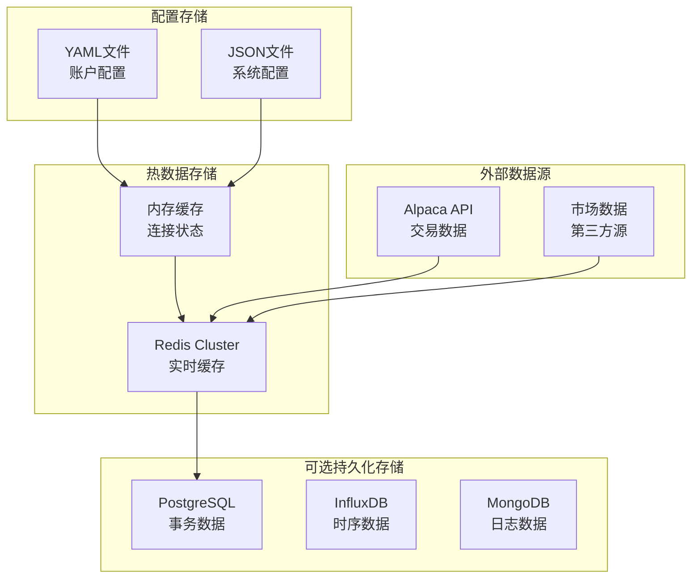
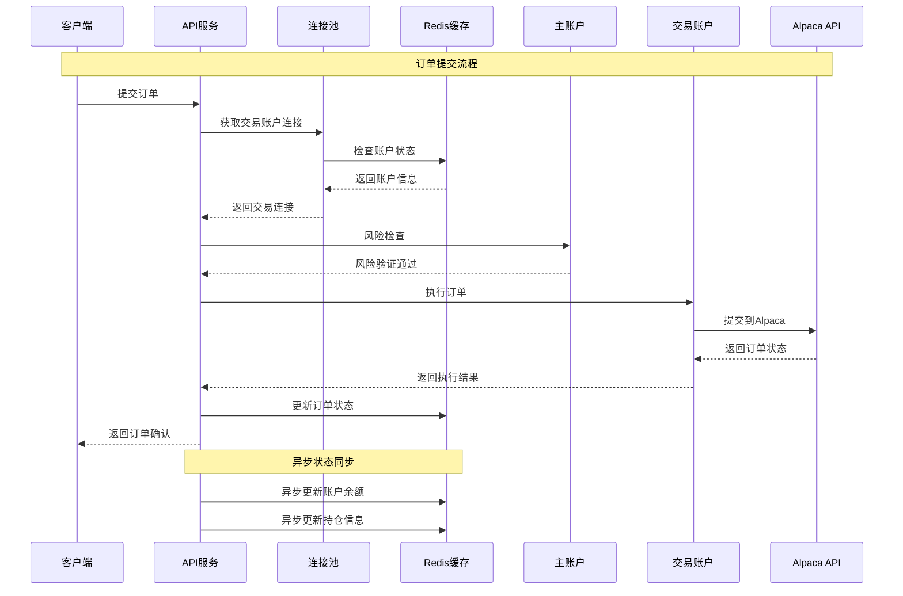
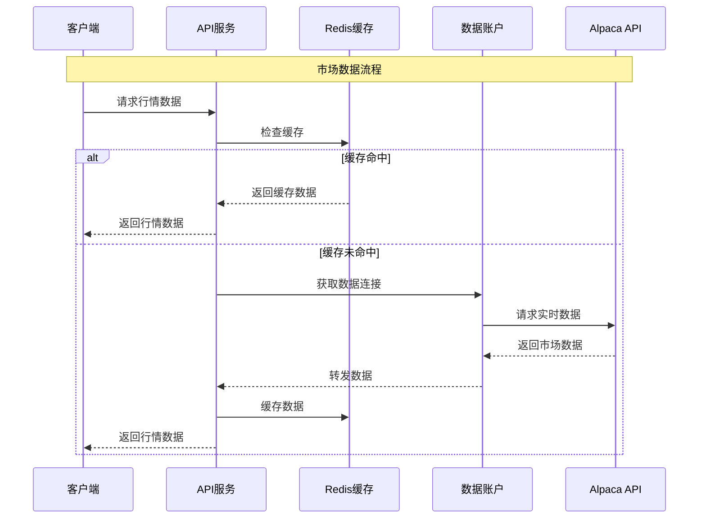
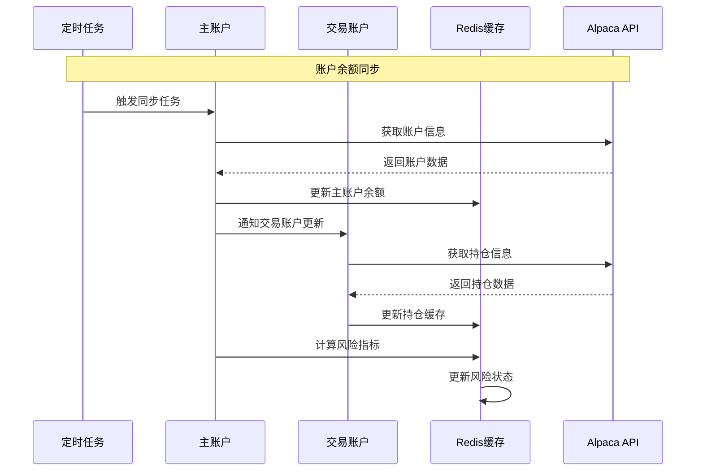

# Opitios Alpaca 数据库架构和数据流设计

## 数据架构概览

本文档详细描述了 Opitios Alpaca 系统的数据架构设计，重点关注主账户与交易账户分离、高性能数据流处理、以及支持1000并发账户的数据存储策略。

## 数据架构原则

### 1. 账户分离原则
- **主账户**: 负责资金管理、风险控制、结算
- **交易账户**: 负责订单执行、持仓管理
- **数据账户**: 负责市场数据获取和分发
- **备用账户**: 负责故障转移和灾难恢复

### 2. 数据一致性策略
- 最终一致性模型
- 事件驱动架构
- 补偿事务机制
- 幂等性保证

### 3. 性能优化原则
- 读写分离
- 缓存优先
- 异步处理
- 批量操作

## 数据存储架构

### 存储技术选型



### 数据分层架构

| 数据层 | 技术选择 | 数据类型 | 特性 |
|--------|----------|----------|------|
| **L1 - 内存缓存** | Python Dict | 连接状态、会话信息 | 毫秒级访问 |
| **L2 - 分布式缓存** | Redis Cluster | 市场数据、账户余额 | 亚毫秒级访问 |
| **L3 - 配置存储** | YAML/JSON | 账户配置、系统配置 | 启动时加载 |
| **L4 - 时序数据** | InfluxDB (可选) | 性能指标、交易记录 | 高写入性能 |
| **L5 - 关系数据** | PostgreSQL (可选) | 用户数据、审计日志 | ACID保证 |

## 账户数据模型

### 1. 主账户数据结构

```yaml
# master_accounts.yaml
master_accounts:
  - account_id: "MASTER_001"
    account_type: "master"
    status: "active"
    risk_profile:
      max_daily_loss: 50000.00
      max_position_size: 100000.00
      allowed_instruments: ["stocks", "options"]
    linked_trading_accounts:
      - "TRADE_001"
      - "TRADE_002"
      - "TRADE_003"
    alpaca_credentials:
      api_key: "encrypted_master_key_1"
      secret_key: "encrypted_master_secret_1"
      paper_trading: false
    last_settlement: "2024-01-15T00:00:00Z"
    created_at: "2024-01-01T00:00:00Z"
```

### 2. 交易账户数据结构

```yaml
# trading_accounts.yaml
trading_accounts:
  - account_id: "TRADE_001"
    account_type: "trading"
    master_account: "MASTER_001"
    status: "active"
    trading_config:
      max_orders_per_minute: 60
      max_concurrent_orders: 10
      allowed_order_types: ["market", "limit", "stop"]
      extended_hours_trading: true
    alpaca_credentials:
      api_key: "encrypted_trade_key_1"
      secret_key: "encrypted_trade_secret_1"
      paper_trading: false
    connection_pool:
      max_connections: 5
      idle_timeout: 300
      health_check_interval: 60
    priority: "high"
    created_at: "2024-01-01T00:00:00Z"
```

### 3. 数据账户配置

```yaml
# data_accounts.yaml
data_accounts:
  - account_id: "DATA_001"
    account_type: "market_data"
    status: "active"
    data_sources:
      - "alpaca_real_time"
      - "alpaca_historical"
    rate_limits:
      quotes_per_second: 100
      bars_per_minute: 1000
    alpaca_credentials:
      api_key: "encrypted_data_key_1"
      secret_key: "encrypted_data_secret_1"
      paper_trading: false
    cache_config:
      ttl_seconds: 30
      max_symbols: 1000
    created_at: "2024-01-01T00:00:00Z"
```

## 数据流架构设计

### 1. 实时交易数据流



### 2. 市场数据流



### 3. 账户同步数据流



## Redis数据结构设计

### 1. 缓存键命名约定

```python
# 缓存键命名规范
CACHE_KEYS = {
    # 账户相关
    "account_balance": "acc:balance:{account_id}",
    "account_positions": "acc:positions:{account_id}",
    "account_orders": "acc:orders:{account_id}",
    "account_status": "acc:status:{account_id}",
    
    # 连接池相关
    "connection_pool": "pool:connections:{account_id}",
    "connection_health": "pool:health:{account_id}",
    
    # 市场数据相关
    "stock_quote": "market:quote:stock:{symbol}",
    "option_quote": "market:quote:option:{symbol}",
    "option_chain": "market:chain:{underlying}:{expiry}",
    
    # 限流相关
    "rate_limit": "limit:{account_id}:{endpoint}",
    
    # 会话相关
    "jwt_session": "session:jwt:{token_hash}",
    "user_context": "session:context:{account_id}"
}
```

### 2. 数据结构实现

```python
# redis_structures.py
import redis.asyncio as redis
import json
from datetime import datetime, timedelta
from typing import Dict, List, Optional

class RedisDataStructures:
    def __init__(self, redis_client):
        self.redis = redis_client
    
    # 账户余额管理
    async def set_account_balance(self, account_id: str, balance_data: dict):
        """设置账户余额"""
        key = f"acc:balance:{account_id}"
        await self.redis.hset(key, mapping={
            "cash": str(balance_data["cash"]),
            "buying_power": str(balance_data["buying_power"]),
            "portfolio_value": str(balance_data["portfolio_value"]),
            "updated_at": datetime.utcnow().isoformat()
        })
        await self.redis.expire(key, 300)  # 5分钟过期
    
    async def get_account_balance(self, account_id: str) -> Optional[dict]:
        """获取账户余额"""
        key = f"acc:balance:{account_id}"
        data = await self.redis.hgetall(key)
        if not data:
            return None
        
        return {
            "cash": float(data["cash"]),
            "buying_power": float(data["buying_power"]),
            "portfolio_value": float(data["portfolio_value"]),
            "updated_at": data["updated_at"]
        }
    
    # 持仓管理
    async def set_positions(self, account_id: str, positions: List[dict]):
        """设置账户持仓"""
        key = f"acc:positions:{account_id}"
        
        # 清除旧数据
        await self.redis.delete(key)
        
        # 存储新数据
        if positions:
            position_data = {}
            for pos in positions:
                symbol = pos["symbol"]
                position_data[symbol] = json.dumps({
                    "qty": pos["qty"],
                    "market_value": pos["market_value"],
                    "unrealized_pl": pos["unrealized_pl"],
                    "side": pos["side"],
                    "updated_at": datetime.utcnow().isoformat()
                })
            await self.redis.hset(key, mapping=position_data)
        
        await self.redis.expire(key, 300)
    
    async def get_positions(self, account_id: str) -> List[dict]:
        """获取账户持仓"""
        key = f"acc:positions:{account_id}"
        data = await self.redis.hgetall(key)
        
        positions = []
        for symbol, pos_json in data.items():
            pos_data = json.loads(pos_json)
            pos_data["symbol"] = symbol
            positions.append(pos_data)
        
        return positions
    
    # 市场数据缓存
    async def set_stock_quote(self, symbol: str, quote_data: dict):
        """缓存股票报价"""
        key = f"market:quote:stock:{symbol}"
        await self.redis.hset(key, mapping={
            "bid_price": str(quote_data["bid_price"]),
            "ask_price": str(quote_data["ask_price"]),
            "last_price": str(quote_data["last_price"]),
            "volume": str(quote_data.get("volume", 0)),
            "timestamp": datetime.utcnow().isoformat()
        })
        await self.redis.expire(key, 30)  # 30秒过期
    
    async def get_stock_quote(self, symbol: str) -> Optional[dict]:
        """获取股票报价"""
        key = f"market:quote:stock:{symbol}"
        data = await self.redis.hgetall(key)
        if not data:
            return None
            
        return {
            "symbol": symbol,
            "bid_price": float(data["bid_price"]) if data["bid_price"] != "None" else None,
            "ask_price": float(data["ask_price"]) if data["ask_price"] != "None" else None,
            "last_price": float(data["last_price"]) if data["last_price"] != "None" else None,
            "volume": int(data.get("volume", 0)),
            "timestamp": data["timestamp"]
        }
    
    # 连接池状态管理
    async def update_connection_health(self, account_id: str, connection_id: str, is_healthy: bool):
        """更新连接健康状态"""
        key = f"pool:health:{account_id}"
        await self.redis.hset(key, connection_id, "1" if is_healthy else "0")
        await self.redis.expire(key, 600)  # 10分钟过期
    
    async def get_healthy_connections(self, account_id: str) -> List[str]:
        """获取健康的连接ID列表"""
        key = f"pool:health:{account_id}"
        data = await self.redis.hgetall(key)
        return [conn_id for conn_id, status in data.items() if status == "1"]
```

## 数据一致性保证

### 1. 事件驱动架构

```python
# event_driven.py
from dataclasses import dataclass
from typing import Dict, List, Callable
import asyncio
import json
from datetime import datetime

@dataclass
class Event:
    event_type: str
    account_id: str
    data: dict
    timestamp: datetime
    event_id: str

class EventBus:
    def __init__(self, redis_client):
        self.redis = redis_client
        self.handlers: Dict[str, List[Callable]] = {}
        self.stream_name = "trading_events"
    
    def subscribe(self, event_type: str, handler: Callable):
        """订阅事件"""
        if event_type not in self.handlers:
            self.handlers[event_type] = []
        self.handlers[event_type].append(handler)
    
    async def publish(self, event: Event):
        """发布事件"""
        event_data = {
            "event_type": event.event_type,
            "account_id": event.account_id,
            "data": json.dumps(event.data),
            "timestamp": event.timestamp.isoformat(),
            "event_id": event.event_id
        }
        
        # 写入Redis Stream
        await self.redis.xadd(self.stream_name, event_data)
        
        # 本地处理
        if event.event_type in self.handlers:
            for handler in self.handlers[event.event_type]:
                try:
                    await handler(event)
                except Exception as e:
                    print(f"事件处理错误: {e}")
    
    async def start_consumer(self, consumer_group: str, consumer_name: str):
        """启动事件消费者"""
        try:
            # 创建消费者组
            await self.redis.xgroup_create(self.stream_name, consumer_group, id="0", mkstream=True)
        except:
            pass  # 组可能已存在
        
        while True:
            try:
                # 读取新消息
                messages = await self.redis.xreadgroup(
                    consumer_group,
                    consumer_name,
                    {self.stream_name: ">"},
                    count=10,
                    block=1000
                )
                
                for stream, msgs in messages:
                    for msg_id, fields in msgs:
                        await self._process_message(msg_id, fields, consumer_group)
                        
            except Exception as e:
                print(f"消费者错误: {e}")
                await asyncio.sleep(1)
    
    async def _process_message(self, msg_id: str, fields: dict, consumer_group: str):
        """处理单个消息"""
        try:
            event = Event(
                event_type=fields["event_type"],
                account_id=fields["account_id"],
                data=json.loads(fields["data"]),
                timestamp=datetime.fromisoformat(fields["timestamp"]),
                event_id=fields["event_id"]
            )
            
            # 处理事件
            if event.event_type in self.handlers:
                for handler in self.handlers[event.event_type]:
                    await handler(event)
            
            # 确认消息处理完成
            await self.redis.xack(self.stream_name, consumer_group, msg_id)
            
        except Exception as e:
            print(f"消息处理失败: {e}")
```

### 2. 补偿事务实现

```python
# compensation.py
from typing import List, Callable, Any
import asyncio

class CompensationAction:
    def __init__(self, action: Callable, args: tuple, kwargs: dict):
        self.action = action
        self.args = args
        self.kwargs = kwargs
    
    async def execute(self):
        """执行补偿动作"""
        await self.action(*self.args, **self.kwargs)

class Saga:
    def __init__(self):
        self.actions: List[Callable] = []
        self.compensations: List[CompensationAction] = []
        self.executed_steps = 0
    
    def add_step(self, action: Callable, compensation: CompensationAction):
        """添加事务步骤"""
        self.actions.append(action)
        self.compensations.append(compensation)
    
    async def execute(self) -> bool:
        """执行Saga事务"""
        try:
            for i, action in enumerate(self.actions):
                await action()
                self.executed_steps = i + 1
            return True
            
        except Exception as e:
            print(f"Saga执行失败，开始补偿: {e}")
            await self._compensate()
            return False
    
    async def _compensate(self):
        """执行补偿操作"""
        # 反向执行已执行步骤的补偿操作
        for i in range(self.executed_steps - 1, -1, -1):
            try:
                await self.compensations[i].execute()
            except Exception as e:
                print(f"补偿操作失败: {e}")

# 使用示例
async def execute_order_saga(order_data: dict):
    """订单执行Saga"""
    saga = Saga()
    
    # 步骤1: 冻结资金
    saga.add_step(
        action=lambda: freeze_funds(order_data["account_id"], order_data["amount"]),
        compensation=CompensationAction(
            unfreeze_funds, 
            (order_data["account_id"], order_data["amount"]), 
            {}
        )
    )
    
    # 步骤2: 提交订单到Alpaca
    saga.add_step(
        action=lambda: submit_order_to_alpaca(order_data),
        compensation=CompensationAction(
            cancel_alpaca_order, 
            (order_data["order_id"],), 
            {}
        )
    )
    
    # 步骤3: 更新本地订单状态
    saga.add_step(
        action=lambda: update_local_order_status(order_data["order_id"], "submitted"),
        compensation=CompensationAction(
            update_local_order_status, 
            (order_data["order_id"], "failed"), 
            {}
        )
    )
    
    return await saga.execute()
```

## 数据监控和指标

### 1. 数据层监控

```python
# monitoring.py
from prometheus_client import Counter, Histogram, Gauge
import time

# 数据访问指标
cache_hits = Counter('cache_hits_total', 'Cache hits', ['cache_type', 'key_type'])
cache_misses = Counter('cache_misses_total', 'Cache misses', ['cache_type', 'key_type'])
cache_latency = Histogram('cache_latency_seconds', 'Cache access latency')

# 数据一致性指标
event_processed = Counter('events_processed_total', 'Events processed', ['event_type'])
event_failed = Counter('events_failed_total', 'Events failed', ['event_type'])
saga_executed = Counter('saga_executed_total', 'Saga transactions', ['outcome'])

# 连接池指标
active_connections = Gauge('active_connections', 'Active connections', ['account_id'])
pool_utilization = Gauge('pool_utilization_ratio', 'Pool utilization', ['account_id'])

class DataMetrics:
    @staticmethod
    def record_cache_access(cache_type: str, key_type: str, hit: bool, latency: float):
        """记录缓存访问指标"""
        if hit:
            cache_hits.labels(cache_type=cache_type, key_type=key_type).inc()
        else:
            cache_misses.labels(cache_type=cache_type, key_type=key_type).inc()
        
        cache_latency.observe(latency)
    
    @staticmethod
    def record_event_processing(event_type: str, success: bool):
        """记录事件处理指标"""
        if success:
            event_processed.labels(event_type=event_type).inc()
        else:
            event_failed.labels(event_type=event_type).inc()
    
    @staticmethod
    def update_connection_metrics(account_id: str, active: int, total: int):
        """更新连接池指标"""
        active_connections.labels(account_id=account_id).set(active)
        utilization = active / total if total > 0 else 0
        pool_utilization.labels(account_id=account_id).set(utilization)
```

### 2. 数据健康检查

```python
# health_check.py
import asyncio
from datetime import datetime, timedelta
from typing import Dict, List

class DataHealthChecker:
    def __init__(self, redis_client, event_bus):
        self.redis = redis_client
        self.event_bus = event_bus
        self.health_status = {}
    
    async def start_health_checks(self):
        """启动健康检查任务"""
        tasks = [
            asyncio.create_task(self._check_cache_health()),
            asyncio.create_task(self._check_event_processing()),
            asyncio.create_task(self._check_data_freshness()),
        ]
        await asyncio.gather(*tasks)
    
    async def _check_cache_health(self):
        """检查缓存健康状态"""
        while True:
            try:
                # 测试Redis连接
                start_time = time.time()
                await self.redis.ping()
                latency = time.time() - start_time
                
                self.health_status["cache"] = {
                    "status": "healthy" if latency < 0.1 else "degraded",
                    "latency": latency,
                    "last_check": datetime.utcnow()
                }
                
            except Exception as e:
                self.health_status["cache"] = {
                    "status": "unhealthy",
                    "error": str(e),
                    "last_check": datetime.utcnow()
                }
            
            await asyncio.sleep(30)
    
    async def _check_event_processing(self):
        """检查事件处理健康状态"""
        while True:
            try:
                # 检查事件流长度
                stream_info = await self.redis.xinfo_stream("trading_events")
                stream_length = stream_info["length"]
                
                self.health_status["events"] = {
                    "status": "healthy" if stream_length < 1000 else "backlog",
                    "queue_length": stream_length,
                    "last_check": datetime.utcnow()
                }
                
            except Exception as e:
                self.health_status["events"] = {
                    "status": "unhealthy",
                    "error": str(e),
                    "last_check": datetime.utcnow()
                }
            
            await asyncio.sleep(60)
    
    async def _check_data_freshness(self):
        """检查数据新鲜度"""
        while True:
            try:
                stale_data_count = 0
                
                # 检查市场数据新鲜度
                pattern = "market:quote:*"
                async for key in self.redis.scan_iter(match=pattern):
                    ttl = await self.redis.ttl(key)
                    if ttl < 10:  # 少于10秒TTL认为数据可能过期
                        stale_data_count += 1
                
                self.health_status["data_freshness"] = {
                    "status": "healthy" if stale_data_count < 10 else "stale",
                    "stale_count": stale_data_count,
                    "last_check": datetime.utcnow()
                }
                
            except Exception as e:
                self.health_status["data_freshness"] = {
                    "status": "unhealthy",
                    "error": str(e),
                    "last_check": datetime.utcnow()
                }
            
            await asyncio.sleep(120)
```

## 数据备份和恢复策略

### 1. 实时数据备份

```python
# backup_strategy.py
import asyncio
import json
from datetime import datetime
from typing import Dict, Any

class DataBackupManager:
    def __init__(self, redis_client):
        self.redis = redis_client
        self.backup_enabled = True
    
    async def start_backup_tasks(self):
        """启动备份任务"""
        if not self.backup_enabled:
            return
            
        tasks = [
            asyncio.create_task(self._backup_critical_data()),
            asyncio.create_task(self._backup_configuration()),
        ]
        await asyncio.gather(*tasks)
    
    async def _backup_critical_data(self):
        """备份关键数据"""
        while True:
            try:
                # 备份账户余额和持仓
                backup_data = {
                    "timestamp": datetime.utcnow().isoformat(),
                    "accounts": {}
                }
                
                # 获取所有账户键
                pattern = "acc:balance:*"
                async for key in self.redis.scan_iter(match=pattern):
                    account_id = key.split(":")[-1]
                    balance_data = await self.redis.hgetall(key)
                    
                    # 获取对应的持仓数据
                    positions_key = f"acc:positions:{account_id}"
                    positions_data = await self.redis.hgetall(positions_key)
                    
                    backup_data["accounts"][account_id] = {
                        "balance": balance_data,
                        "positions": positions_data
                    }
                
                # 写入备份文件
                backup_filename = f"backup_{datetime.utcnow().strftime('%Y%m%d_%H%M%S')}.json"
                with open(f"backups/{backup_filename}", 'w') as f:
                    json.dump(backup_data, f, indent=2)
                
            except Exception as e:
                print(f"备份失败: {e}")
            
            await asyncio.sleep(3600)  # 每小时备份一次
    
    async def restore_from_backup(self, backup_file: str):
        """从备份文件恢复数据"""
        try:
            with open(backup_file, 'r') as f:
                backup_data = json.load(f)
            
            for account_id, account_data in backup_data["accounts"].items():
                # 恢复余额数据
                balance_key = f"acc:balance:{account_id}"
                if account_data["balance"]:
                    await self.redis.hset(balance_key, mapping=account_data["balance"])
                
                # 恢复持仓数据
                positions_key = f"acc:positions:{account_id}"
                if account_data["positions"]:
                    await self.redis.hset(positions_key, mapping=account_data["positions"])
            
            print(f"数据恢复完成，备份时间: {backup_data['timestamp']}")
            
        except Exception as e:
            print(f"数据恢复失败: {e}")
```

## 性能优化策略

### 1. 数据预加载

```python
# preloader.py
import asyncio
from typing import List

class DataPreloader:
    def __init__(self, redis_client, account_configs: dict):
        self.redis = redis_client
        self.account_configs = account_configs
    
    async def preload_critical_data(self):
        """预加载关键数据"""
        tasks = []
        
        # 预加载热门股票报价
        hot_symbols = ["AAPL", "TSLA", "GOOGL", "MSFT", "AMZN", "NVDA", "META", "NFLX"]
        for symbol in hot_symbols:
            task = asyncio.create_task(self._preload_stock_quote(symbol))
            tasks.append(task)
        
        # 预加载账户配置到缓存
        for account_id in self.account_configs.keys():
            task = asyncio.create_task(self._preload_account_config(account_id))
            tasks.append(task)
        
        await asyncio.gather(*tasks, return_exceptions=True)
    
    async def _preload_stock_quote(self, symbol: str):
        """预加载股票报价"""
        try:
            # 这里应该从Alpaca API获取实际数据
            # 模拟数据预加载
            quote_data = {
                "bid_price": 185.25,
                "ask_price": 185.30,
                "last_price": 185.27,
                "volume": 1000000
            }
            
            key = f"market:quote:stock:{symbol}"
            await self.redis.hset(key, mapping={
                "bid_price": str(quote_data["bid_price"]),
                "ask_price": str(quote_data["ask_price"]),
                "last_price": str(quote_data["last_price"]),
                "volume": str(quote_data["volume"]),
                "timestamp": datetime.utcnow().isoformat()
            })
            await self.redis.expire(key, 30)
            
        except Exception as e:
            print(f"预加载股票报价失败 {symbol}: {e}")
    
    async def _preload_account_config(self, account_id: str):
        """预加载账户配置"""
        try:
            config = self.account_configs[account_id]
            key = f"acc:config:{account_id}"
            await self.redis.hset(key, mapping={
                "account_type": config["account_type"],
                "status": config["status"],
                "max_connections": str(config.get("connection_pool", {}).get("max_connections", 5)),
                "priority": config.get("priority", "normal")
            })
            await self.redis.expire(key, 3600)  # 1小时过期
            
        except Exception as e:
            print(f"预加载账户配置失败 {account_id}: {e}")
```

这个数据架构设计确保了系统能够高效处理大量并发账户的数据访问需求，同时保证数据的一致性和可靠性。通过分层存储、事件驱动和补偿事务等机制，系统能够在高性能和数据一致性之间取得最佳平衡。