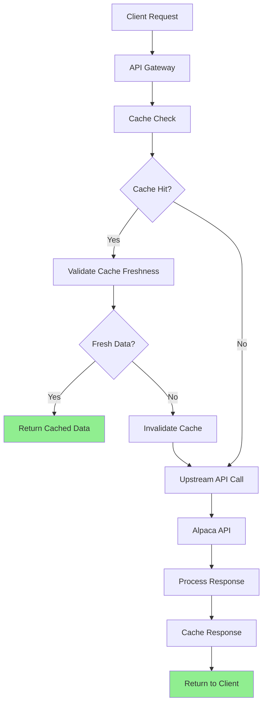

# Performance Architecture - Caching and Optimization Strategies

## Overview

This document defines the performance architecture for the opitios_alpaca service, focusing on optimizing the delivery of real market data while maintaining data integrity. The architecture emphasizes intelligent caching strategies that respect data freshness requirements and never introduce calculated or stale data.

## Performance Principles

### 1. Real Data Performance Optimization
- **Cache Real Data Only**: Never cache calculated or mock data
- **Respect Data Freshness**: Honor market data time sensitivity
- **Intelligent TTL**: Dynamic cache expiration based on market conditions
- **Source Attribution**: Track data source in all cached responses

### 2. Scalable Architecture
- **Horizontal Scaling**: Stateless service design for easy scaling
- **Connection Pooling**: Efficient resource utilization
- **Async Processing**: Non-blocking I/O operations
- **Load Distribution**: Balanced request distribution

### 3. Monitoring-Driven Optimization
- **Performance Metrics**: Comprehensive performance tracking
- **Cache Analytics**: Cache hit rates and effectiveness metrics
- **Resource Utilization**: Memory, CPU, and network monitoring
- **User Experience**: Response time and availability tracking

## Caching Architecture

### Cache Layer Design



### Redis Caching Implementation

```python
class MarketDataCache:
    """High-performance caching for real market data"""
    
    def __init__(self):
        self.redis_client = self._create_redis_client()
        self.cache_metrics = CacheMetrics()
        
    def _create_redis_client(self) -> redis.Redis:
        """Create optimized Redis client"""
        return redis.Redis(
            host=settings.redis_host,
            port=settings.redis_port,
            db=0,
            max_connections=100,
            retry_on_timeout=True,
            socket_keepalive=True,
            socket_keepalive_options={},
            health_check_interval=30,
            decode_responses=True
        )
    
    async def get_stock_quote(self, symbol: str) -> Optional[CachedStockData]:
        """Retrieve stock quote with intelligent freshness checking"""
        
        cache_key = self._generate_cache_key("stock_quote", symbol)
        
        try:
            # Attempt cache retrieval
            cached_raw = await self.redis_client.get(cache_key)
            if not cached_raw:
                await self.cache_metrics.record_cache_miss("stock_quote")
                return None
            
            cached_data = json.loads(cached_raw)
            
            # Validate cache freshness based on market conditions
            if await self._is_cache_fresh(cached_data, "stock_quote"):
                await self.cache_metrics.record_cache_hit("stock_quote")
                return CachedStockData(**cached_data)
            else:
                # Stale data - remove from cache
                await self.redis_client.delete(cache_key)
                await self.cache_metrics.record_cache_stale("stock_quote")
                return None
                
        except (redis.RedisError, json.JSONDecodeError) as e:
            logger.error(f"Cache retrieval error for {symbol}: {e}")
            await self.cache_metrics.record_cache_error("stock_quote")
            return None
    
    async def cache_stock_quote(self, symbol: str, data: RealStockData) -> None:
        """Cache stock quote with intelligent TTL"""
        
        cache_key = self._generate_cache_key("stock_quote", symbol)
        ttl = await self._calculate_dynamic_ttl(data, "stock_quote")
        
        cache_payload = {
            "symbol": symbol,
            "data": data.dict(),
            "cached_at": datetime.utcnow().isoformat(),
            "data_source": data.data_source,
            "market_status": await self._get_market_status(),
            "ttl_seconds": ttl
        }
        
        try:
            await self.redis_client.setex(
                cache_key, 
                ttl, 
                json.dumps(cache_payload, default=str)
            )
            await self.cache_metrics.record_cache_write("stock_quote", ttl)
            
        except redis.RedisError as e:
            logger.error(f"Cache write error for {symbol}: {e}")
            await self.cache_metrics.record_cache_error("stock_quote")
    
    async def _calculate_dynamic_ttl(self, data: RealStockData, data_type: str) -> int:
        """Calculate TTL based on market conditions and data type"""
        
        market_status = await self._get_market_status()
        base_ttl = {
            "stock_quote": 30,      # 30 seconds during market hours
            "option_quote": 60,     # 1 minute for options
            "historical_data": 3600 # 1 hour for historical data
        }.get(data_type, 30)
        
        # Adjust TTL based on market status
        if market_status == "closed":
            return base_ttl * 10    # 10x longer when market closed
        elif market_status in ["pre_market", "after_hours"]:
            return base_ttl * 3     # 3x longer for extended hours
        else:
            return base_ttl         # Standard TTL during market hours
    
    async def _is_cache_fresh(self, cached_data: Dict, data_type: str) -> bool:
        """Determine if cached data is still fresh"""
        
        cached_at = datetime.fromisoformat(cached_data["cached_at"])
        age_seconds = (datetime.utcnow() - cached_at).total_seconds()
        
        # Get current market conditions
        current_market_status = await self._get_market_status()
        cached_market_status = cached_data.get("market_status", "unknown")
        
        # If market status changed, consider data stale
        if current_market_status != cached_market_status:
            return False
        
        # Check age against expected TTL
        expected_ttl = cached_data.get("ttl_seconds", 30)
        return age_seconds < expected_ttl
    
    def _generate_cache_key(self, data_type: str, identifier: str) -> str:
        """Generate consistent cache keys"""
        return f"opitios:v2:{data_type}:{identifier.upper()}"
```

### Multi-Level Caching Strategy

```python
class MultiLevelCache:
    """Implement multi-level caching for optimal performance"""
    
    def __init__(self):
        self.l1_cache = LRUCache(maxsize=1000)  # In-memory L1 cache
        self.l2_cache = MarketDataCache()       # Redis L2 cache
        
    async def get_data(self, cache_key: str, data_fetcher: Callable) -> Any:
        """Multi-level cache retrieval with fallback to data source"""
        
        # L1 Cache check (in-memory)
        l1_data = self.l1_cache.get(cache_key)
        if l1_data and self._is_l1_fresh(l1_data):
            await self._record_metrics("l1_hit")
            return l1_data["data"]
        
        # L2 Cache check (Redis)
        l2_data = await self.l2_cache.get(cache_key)
        if l2_data:
            # Populate L1 cache
            self.l1_cache[cache_key] = {
                "data": l2_data,
                "timestamp": datetime.utcnow()
            }
            await self._record_metrics("l2_hit")
            return l2_data
        
        # Cache miss - fetch from source
        fresh_data = await data_fetcher()
        
        # Store in both cache levels
        await self.l2_cache.set(cache_key, fresh_data)
        self.l1_cache[cache_key] = {
            "data": fresh_data,
            "timestamp": datetime.utcnow()
        }
        
        await self._record_metrics("cache_miss")
        return fresh_data
    
    def _is_l1_fresh(self, cached_item: Dict) -> bool:
        """Check if L1 cache item is still fresh (very short TTL)"""
        age = (datetime.utcnow() - cached_item["timestamp"]).total_seconds()
        return age < 10  # 10 second L1 cache TTL
```

## Connection Pool Optimization

### HTTP Connection Management

```python
class OptimizedHTTPClient:
    """Optimized HTTP client for Alpaca API calls"""
    
    def __init__(self):
        self.session = None
        self.connection_pool_metrics = ConnectionPoolMetrics()
    
    async def __aenter__(self):
        """Create optimized aiohttp session"""
        
        # Optimized connector configuration
        connector = aiohttp.TCPConnector(
            limit=200,                    # Total connection limit
            limit_per_host=50,            # Per-host connection limit
            ttl_dns_cache=300,            # DNS cache TTL (5 minutes)
            use_dns_cache=True,
            keepalive_timeout=60,         # Keep connections alive for 60s
            enable_cleanup_closed=True,   # Clean up closed connections
            force_close=False,            # Reuse connections
            ssl=self._create_ssl_context()
        )
        
        # Optimized timeout configuration
        timeout = aiohttp.ClientTimeout(
            total=30,           # Total request timeout
            connect=10,         # Connection timeout
            sock_read=10,       # Socket read timeout
            sock_connect=5      # Socket connection timeout
        )
        
        # Create session with optimizations
        self.session = aiohttp.ClientSession(
            connector=connector,
            timeout=timeout,
            headers=self._get_default_headers(),
            trace_request_start=self._trace_request_start,
            trace_request_end=self._trace_request_end
        )
        
        return self
    
    async def __aexit__(self, exc_type, exc_val, exc_tb):
        """Clean up session"""
        if self.session:
            await self.session.close()
    
    async def make_request(self, method: str, url: str, **kwargs) -> Dict:
        """Make optimized HTTP request with retries"""
        
        for attempt in range(3):  # 3 retry attempts
            try:
                async with self.session.request(method, url, **kwargs) as response:
                    # Record response metrics
                    await self.connection_pool_metrics.record_request(
                        response.status, 
                        response.headers.get('X-Response-Time')
                    )
                    
                    if response.status == 200:
                        return await response.json()
                    elif response.status == 429:  # Rate limited
                        retry_after = int(response.headers.get('Retry-After', 60))
                        if attempt < 2:  # Don't wait on last attempt
                            await asyncio.sleep(retry_after)
                        continue
                    else:
                        response.raise_for_status()
                        
            except asyncio.TimeoutError:
                if attempt < 2:
                    await asyncio.sleep(2 ** attempt)  # Exponential backoff
                    continue
                raise
            except aiohttp.ClientError as e:
                if attempt < 2:
                    await asyncio.sleep(2 ** attempt)
                    continue
                raise
        
        raise HTTPException(status_code=503, detail="Upstream service unavailable")
    
    def _create_ssl_context(self):
        """Create optimized SSL context"""
        import ssl
        
        context = ssl.create_default_context()
        context.minimum_version = ssl.TLSVersion.TLSv1_2
        context.set_ciphers('ECDHE+AESGCM:ECDHE+CHACHA20:DHE+AESGCM')
        
        return context
    
    async def _trace_request_start(self, session, trace_config_ctx, params):
        """Trace request start for metrics"""
        trace_config_ctx.start_time = time.time()
    
    async def _trace_request_end(self, session, trace_config_ctx, params):
        """Trace request end for metrics"""
        duration = time.time() - trace_config_ctx.start_time
        await self.connection_pool_metrics.record_request_duration(duration)
```

## Async Processing Optimization

### Concurrent Request Handling

```python
class ConcurrentDataProcessor:
    """Handle multiple data requests concurrently"""
    
    def __init__(self, max_concurrent: int = 50):
        self.semaphore = asyncio.Semaphore(max_concurrent)
        self.performance_metrics = PerformanceMetrics()
    
    async def process_batch_quotes(self, symbols: List[str]) -> List[Dict]:
        """Process multiple symbol requests concurrently"""
        
        start_time = time.time()
        
        async def process_single_symbol(symbol: str) -> Dict:
            async with self.semaphore:
                try:
                    return await self._get_single_quote(symbol)
                except Exception as e:
                    return {
                        "symbol": symbol,
                        "error": str(e),
                        "status": "failed"
                    }
        
        # Create tasks for all symbols
        tasks = [process_single_symbol(symbol) for symbol in symbols]
        
        # Execute with timeout
        try:
            results = await asyncio.wait_for(
                asyncio.gather(*tasks, return_exceptions=True),
                timeout=30.0
            )
        except asyncio.TimeoutError:
            # Handle partial results on timeout
            results = [{"error": "Request timeout", "status": "timeout"} 
                      for _ in symbols]
        
        # Record performance metrics
        duration = time.time() - start_time
        await self.performance_metrics.record_batch_operation(
            symbol_count=len(symbols),
            duration=duration,
            success_count=sum(1 for r in results if isinstance(r, dict) and "error" not in r)
        )
        
        return results
    
    async def _get_single_quote(self, symbol: str) -> Dict:
        """Get single quote with caching and error handling"""
        
        # Try cache first
        cached_data = await self.cache.get_stock_quote(symbol)
        if cached_data:
            return cached_data.dict()
        
        # Fetch from Alpaca
        async with OptimizedHTTPClient() as client:
            quote_data = await client.make_request(
                "GET", 
                f"{settings.alpaca_base_url}/v2/stocks/{symbol}/quotes/latest"
            )
        
        # Process and cache
        processed_data = await self._process_quote_data(quote_data)
        await self.cache.cache_stock_quote(symbol, processed_data)
        
        return processed_data.dict()
```

## Memory Management

### Efficient Data Structures

```python
class MemoryOptimizedData:
    """Memory-efficient data structures for market data"""
    
    @dataclass
    class CompactQuote:
        """Memory-optimized quote structure"""
        symbol: str
        bid: Optional[float] = None
        ask: Optional[float] = None
        timestamp: int = 0  # Store as Unix timestamp to save memory
        
        def to_dict(self) -> Dict:
            """Convert to full dictionary format"""
            return {
                "symbol": self.symbol,
                "bid_price": self.bid,
                "ask_price": self.ask,
                "timestamp": datetime.fromtimestamp(self.timestamp),
                "data_source": "alpaca_real_time"
            }
    
    @staticmethod
    def from_alpaca_response(data: Dict) -> 'CompactQuote':
        """Create compact quote from Alpaca response"""
        return MemoryOptimizedData.CompactQuote(
            symbol=data["symbol"],
            bid=data.get("bid_price"),
            ask=data.get("ask_price"),
            timestamp=int(data["timestamp"].timestamp())
        )

class MemoryManager:
    """Monitor and manage memory usage"""
    
    def __init__(self):
        self.memory_threshold = 0.8  # 80% memory usage threshold
        
    async def monitor_memory_usage(self):
        """Monitor system memory usage"""
        import psutil
        
        memory = psutil.virtual_memory()
        if memory.percent > self.memory_threshold * 100:
            await self._trigger_memory_cleanup()
    
    async def _trigger_memory_cleanup(self):
        """Trigger memory cleanup procedures"""
        
        # Clear L1 cache
        self.l1_cache.clear()
        
        # Run garbage collection
        import gc
        gc.collect()
        
        # Log memory cleanup
        logger.warning("Memory cleanup triggered due to high usage")
```

## Performance Monitoring

### Real-time Performance Metrics

```python
class PerformanceMonitor:
    """Comprehensive performance monitoring"""
    
    def __init__(self):
        self.metrics_client = PrometheusMetrics()
        
    async def track_api_performance(self, endpoint: str, duration: float, 
                                  status_code: int, cache_hit: bool):
        """Track API endpoint performance"""
        
        # Response time histogram
        self.metrics_client.observe_histogram(
            "api_response_time_seconds",
            duration,
            labels={"endpoint": endpoint, "status": str(status_code)}
        )
        
        # Cache hit rate
        self.metrics_client.increment_counter(
            "cache_requests_total",
            labels={
                "endpoint": endpoint,
                "result": "hit" if cache_hit else "miss"
            }
        )
        
        # Request rate
        self.metrics_client.increment_counter(
            "api_requests_total",
            labels={"endpoint": endpoint, "status": str(status_code)}
        )
    
    async def track_data_freshness(self, symbol: str, data_age_seconds: float):
        """Track data freshness metrics"""
        
        self.metrics_client.set_gauge(
            "market_data_age_seconds",
            data_age_seconds,
            labels={"symbol": symbol, "data_type": "stock_quote"}
        )
    
    async def track_upstream_performance(self, provider: str, duration: float, 
                                       success: bool):
        """Track upstream API performance"""
        
        self.metrics_client.observe_histogram(
            "upstream_api_response_time_seconds",
            duration,
            labels={"provider": provider}
        )
        
        self.metrics_client.increment_counter(
            "upstream_api_requests_total",
            labels={
                "provider": provider,
                "result": "success" if success else "failure"
            }
        )
```

## Performance Targets and SLAs

### Service Level Objectives

| Metric | Target | Measurement |
|--------|--------|-------------|
| **Response Time** | | |
| Cached data | < 50ms | 95th percentile |
| Real-time data | < 500ms | 95th percentile |
| Batch operations (20 symbols) | < 2s | 95th percentile |
| **Throughput** | | |
| Requests per second | 1000+ | Single instance |
| Concurrent users | 500+ | Simultaneous connections |
| **Cache Performance** | | |
| Cache hit rate | > 80% | During market hours |
| Cache miss penalty | < 2x | Compared to cache hit |
| **Data Freshness** | | |
| Real-time quotes | < 30s | Maximum age |
| Options data | < 60s | Maximum age |
| Historical data | < 1h | Maximum age |
| **Availability** | | |
| Service uptime | 99.9% | Excluding upstream issues |
| Data availability | > 95% | Real data success rate |

### Performance Optimization Strategies

```python
class PerformanceOptimizer:
    """Dynamic performance optimization"""
    
    async def optimize_cache_strategy(self, current_metrics: Dict):
        """Dynamically adjust cache strategy based on performance"""
        
        hit_rate = current_metrics.get("cache_hit_rate", 0)
        avg_response_time = current_metrics.get("avg_response_time", 0)
        
        if hit_rate < 0.7:  # Low hit rate
            # Increase cache TTL during low volatility periods
            await self._adjust_cache_ttl(multiplier=1.5)
            
        if avg_response_time > 1.0:  # High response time
            # Implement more aggressive prefetching
            await self._enable_prefetching()
    
    async def scale_connection_pool(self, current_load: float):
        """Dynamically scale connection pool based on load"""
        
        if current_load > 0.8:
            # Increase connection pool size
            await self._scale_connections(factor=1.2)
        elif current_load < 0.3:
            # Decrease connection pool to save resources
            await self._scale_connections(factor=0.8)
```

This performance architecture ensures optimal delivery of real market data while maintaining strict data integrity and providing comprehensive monitoring to track and optimize system performance continuously.