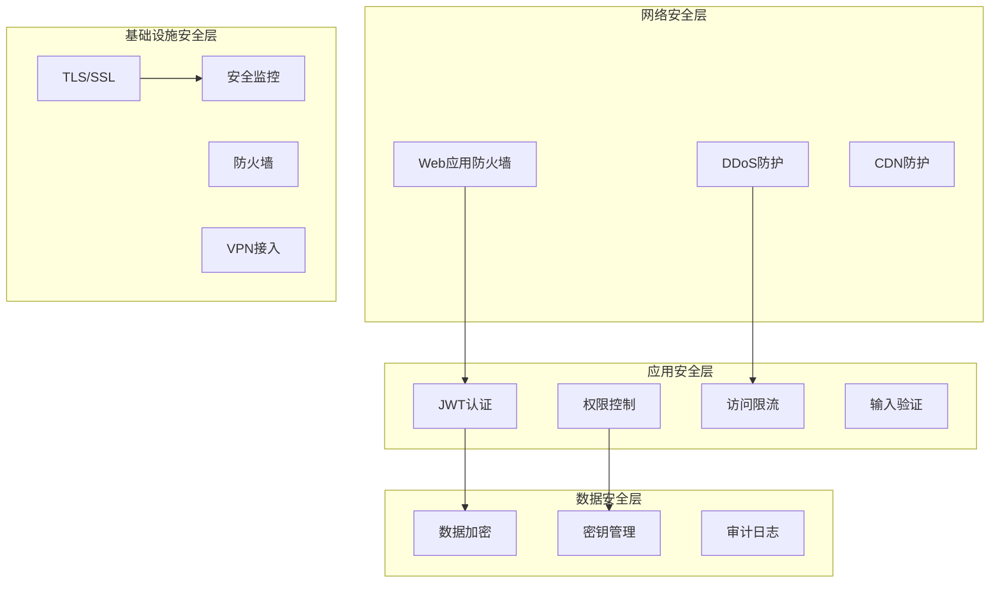
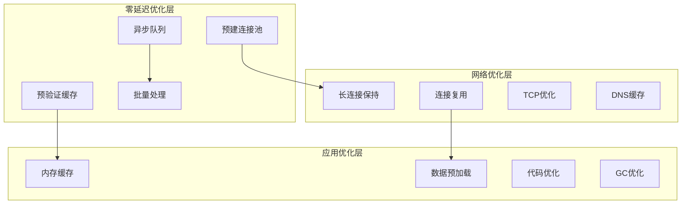

# Opitios Alpaca 安全和性能考虑文档

## 概览

本文档详细描述了 Opitios Alpaca 高性能交易系统的安全架构和性能优化策略，重点关注零延迟交易系统的设计、安全防护机制以及支持1000并发账户的性能优化方案。

## 安全架构设计

### 1. 多层安全防护体系



### 2. 认证与授权机制

#### JWT认证架构
```python
# security/jwt_manager.py
import jwt
import secrets
from datetime import datetime, timedelta
from cryptography.hazmat.primitives import hashes
from cryptography.hazmat.primitives.kdf.pbkdf2 import PBKDF2HMAC
from cryptography.fernet import Fernet
import base64
import os

class EnhancedJWTManager:
    def __init__(self):
        # 从环境变量或安全配置获取密钥
        self.secret_key = os.environ.get('JWT_SECRET_KEY', self._generate_secret())
        self.algorithm = 'HS256'
        self.access_token_expire = timedelta(hours=24)
        self.refresh_token_expire = timedelta(days=7)
        
        # 初始化加密器
        self.fernet = Fernet(self._derive_encryption_key())
        
        # Token黑名单（Redis存储）
        self.blacklist_prefix = "jwt:blacklist:"
        
    def _generate_secret(self) -> str:
        """生成安全的密钥"""
        return base64.urlsafe_b64encode(secrets.token_bytes(32)).decode()
    
    def _derive_encryption_key(self) -> bytes:
        """派生加密密钥"""
        password = self.secret_key.encode()
        salt = b'opitios_alpaca_salt'  # 在生产环境中应该是随机生成的
        kdf = PBKDF2HMAC(
            algorithm=hashes.SHA256(),
            length=32,
            salt=salt,
            iterations=100000,
        )
        return base64.urlsafe_b64encode(kdf.derive(password))
    
    def create_access_token(self, account_id: str, permissions: list, 
                          account_type: str = "trading") -> str:
        """创建访问令牌"""
        now = datetime.utcnow()
        payload = {
            'sub': account_id,  # Subject (账户ID)
            'iat': now,  # Issued At
            'exp': now + self.access_token_expire,  # Expiration
            'nbf': now,  # Not Before
            'iss': 'opitios-alpaca',  # Issuer
            'aud': 'trading-api',  # Audience
            'jti': secrets.token_urlsafe(16),  # JWT ID (防重放)
            'account_type': account_type,
            'permissions': permissions,
            'token_type': 'access'
        }
        
        return jwt.encode(payload, self.secret_key, algorithm=self.algorithm)
    
    def create_refresh_token(self, account_id: str) -> str:
        """创建刷新令牌"""
        now = datetime.utcnow()
        payload = {
            'sub': account_id,
            'iat': now,
            'exp': now + self.refresh_token_expire,
            'iss': 'opitios-alpaca',
            'aud': 'trading-api',
            'jti': secrets.token_urlsafe(16),
            'token_type': 'refresh'
        }
        
        return jwt.encode(payload, self.secret_key, algorithm=self.algorithm)
    
    def verify_token(self, token: str, redis_client=None) -> dict:
        """验证令牌"""
        try:
            # 解码JWT
            payload = jwt.decode(
                token,
                self.secret_key,
                algorithms=[self.algorithm],
                audience='trading-api',
                issuer='opitios-alpaca'
            )
            
            # 检查令牌是否在黑名单中
            if redis_client:
                jti = payload.get('jti')
                if jti and await redis_client.exists(f"{self.blacklist_prefix}{jti}"):
                    raise jwt.InvalidTokenError("Token has been revoked")
            
            return payload
            
        except jwt.ExpiredSignatureError:
            raise SecurityError("Token has expired")
        except jwt.InvalidTokenError as e:
            raise SecurityError(f"Invalid token: {str(e)}")
    
    async def revoke_token(self, token: str, redis_client):
        """撤销令牌"""
        try:
            payload = jwt.decode(
                token, self.secret_key, 
                algorithms=[self.algorithm],
                options={"verify_exp": False}  # 即使过期也要撤销
            )
            
            jti = payload.get('jti')
            exp = payload.get('exp')
            
            if jti and exp:
                # 计算TTL（直到令牌自然过期）
                ttl = max(0, exp - datetime.utcnow().timestamp())
                await redis_client.setex(
                    f"{self.blacklist_prefix}{jti}", 
                    int(ttl), 
                    "revoked"
                )
                
        except Exception as e:
            raise SecurityError(f"Failed to revoke token: {str(e)}")

class SecurityError(Exception):
    """安全相关异常"""
    pass
```

#### 权限控制系统
```python
# security/permissions.py
from enum import Enum
from typing import Set, Dict, List
from functools import wraps

class Permission(Enum):
    # 交易权限
    TRADE_STOCKS = "trade:stocks"
    TRADE_OPTIONS = "trade:options" 
    VIEW_POSITIONS = "view:positions"
    VIEW_ORDERS = "view:orders"
    CANCEL_ORDERS = "cancel:orders"
    
    # 账户权限
    VIEW_ACCOUNT = "view:account"
    MANAGE_ACCOUNT = "manage:account"
    
    # 市场数据权限
    VIEW_MARKET_DATA = "view:market_data"
    VIEW_REAL_TIME_DATA = "view:realtime_data"
    
    # 管理权限
    ADMIN_ACCOUNTS = "admin:accounts"
    ADMIN_SYSTEM = "admin:system"
    VIEW_METRICS = "view:metrics"

class RolePermissions:
    """角色权限映射"""
    
    ROLES = {
        "trading": {
            Permission.TRADE_STOCKS,
            Permission.TRADE_OPTIONS,
            Permission.VIEW_POSITIONS,
            Permission.VIEW_ORDERS,
            Permission.CANCEL_ORDERS,
            Permission.VIEW_ACCOUNT,
            Permission.VIEW_MARKET_DATA,
            Permission.VIEW_REAL_TIME_DATA
        },
        
        "market_data": {
            Permission.VIEW_MARKET_DATA,
            Permission.VIEW_REAL_TIME_DATA,
            Permission.VIEW_ACCOUNT
        },
        
        "admin": {
            Permission.ADMIN_ACCOUNTS,
            Permission.ADMIN_SYSTEM,
            Permission.VIEW_METRICS,
            Permission.VIEW_ACCOUNT,
            Permission.VIEW_MARKET_DATA
        }
    }
    
    @classmethod
    def get_permissions(cls, role: str) -> Set[Permission]:
        """获取角色权限"""
        return cls.ROLES.get(role, set())

def require_permission(permission: Permission):
    """权限检查装饰器"""
    def decorator(func):
        @wraps(func)
        async def wrapper(*args, **kwargs):
            # 从请求上下文获取用户权限
            request = kwargs.get('request') or (args[0] if args else None)
            if not request or not hasattr(request.state, 'permissions'):
                raise PermissionError("Authentication required")
            
            user_permissions = set(request.state.permissions)
            if permission not in user_permissions:
                raise PermissionError(f"Permission {permission.value} required")
            
            return await func(*args, **kwargs)
        return wrapper
    return decorator
```

### 3. 数据加密和密钥管理

#### 敏感数据加密
```python
# security/encryption.py
from cryptography.fernet import Fernet
from cryptography.hazmat.primitives import hashes
from cryptography.hazmat.primitives.kdf.pbkdf2 import PBKDF2HMAC
from cryptography.hazmat.primitives.ciphers import Cipher, algorithms, modes
import base64
import os
import secrets

class CredentialsManager:
    """凭据加密管理器"""
    
    def __init__(self):
        self.master_key = self._get_or_create_master_key()
        self.fernet = Fernet(self.master_key)
    
    def _get_or_create_master_key(self) -> bytes:
        """获取或创建主密钥"""
        key_file = "master.key"
        
        if os.path.exists(key_file):
            with open(key_file, 'rb') as f:
                return f.read()
        else:
            # 生成新的主密钥
            key = Fernet.generate_key()
            with open(key_file, 'wb') as f:
                f.write(key)
            # 设置文件权限（仅所有者可读）
            os.chmod(key_file, 0o600)
            return key
    
    def encrypt_credentials(self, api_key: str, secret_key: str) -> dict:
        """加密API凭据"""
        return {
            'api_key_encrypted': self.fernet.encrypt(api_key.encode()).decode(),
            'secret_key_encrypted': self.fernet.encrypt(secret_key.encode()).decode()
        }
    
    def decrypt_credentials(self, encrypted_data: dict) -> dict:
        """解密API凭据"""
        return {
            'api_key': self.fernet.decrypt(encrypted_data['api_key_encrypted'].encode()).decode(),
            'secret_key': self.fernet.decrypt(encrypted_data['secret_key_encrypted'].encode()).decode()
        }

class FieldLevelEncryption:
    """字段级加密"""
    
    def __init__(self, encryption_key: bytes):
        self.cipher_suite = Fernet(encryption_key)
    
    def encrypt_field(self, data: str) -> str:
        """加密单个字段"""
        if not data:
            return data
        return self.cipher_suite.encrypt(data.encode()).decode()
    
    def decrypt_field(self, encrypted_data: str) -> str:
        """解密单个字段"""
        if not encrypted_data:
            return encrypted_data
        return self.cipher_suite.decrypt(encrypted_data.encode()).decode()
    
    def encrypt_dict(self, data: dict, fields_to_encrypt: list) -> dict:
        """加密字典中的指定字段"""
        result = data.copy()
        for field in fields_to_encrypt:
            if field in result and result[field]:
                result[field] = self.encrypt_field(str(result[field]))
        return result
```

### 4. 网络安全防护

#### API限流和DDoS防护
```python
# security/rate_limiting.py
import asyncio
import time
from typing import Dict, Tuple
from collections import defaultdict, deque
import redis.asyncio as redis

class AdvancedRateLimiter:
    """高级限流器"""
    
    def __init__(self, redis_client):
        self.redis = redis_client
        self.local_cache = defaultdict(lambda: defaultdict(deque))
        
        # 不同级别的限流配置
        self.limits = {
            # 全局限流
            "global": {"requests": 10000, "window": 60},
            
            # 账户级限流
            "account": {"requests": 1000, "window": 60},
            
            # IP级限流
            "ip": {"requests": 100, "window": 60},
            
            # 端点级限流
            "endpoint": {
                "/api/v1/stocks/order": {"requests": 10, "window": 60},
                "/api/v1/options/order": {"requests": 10, "window": 60},
                "/api/v1/stocks/quote": {"requests": 100, "window": 60},
                "/api/v1/options/quote": {"requests": 50, "window": 60}
            }
        }
    
    async def check_rate_limit(self, identifier: str, limit_type: str, 
                             endpoint: str = None) -> Tuple[bool, dict]:
        """检查限流"""
        
        # 获取限流配置
        if limit_type == "endpoint" and endpoint:
            config = self.limits["endpoint"].get(endpoint, {"requests": 60, "window": 60})
        else:
            config = self.limits.get(limit_type, {"requests": 60, "window": 60})
        
        # 使用Redis滑动窗口算法
        return await self._sliding_window_check(
            identifier, 
            config["requests"], 
            config["window"]
        )
    
    async def _sliding_window_check(self, key: str, limit: int, window: int) -> Tuple[bool, dict]:
        """滑动窗口限流检查"""
        now = time.time()
        
        # Redis Lua脚本保证原子性
        lua_script = """
        local key = KEYS[1]
        local window = tonumber(ARGV[1])
        local limit = tonumber(ARGV[2])
        local now = tonumber(ARGV[3])
        
        -- 移除过期的请求
        redis.call('ZREMRANGEBYSCORE', key, 0, now - window)
        
        -- 获取当前窗口内的请求数
        local current = redis.call('ZCARD', key)
        
        if current < limit then
            -- 添加新请求
            redis.call('ZADD', key, now, now)
            redis.call('EXPIRE', key, window)
            return {1, limit - current - 1, now + window}
        else
            return {0, 0, now + window}
        end
        """
        
        try:
            result = await self.redis.eval(
                lua_script, 1, f"rate_limit:{key}", window, limit, now
            )
            
            allowed = bool(result[0])
            remaining = result[1]
            reset_time = result[2]
            
            return allowed, {
                "limit": limit,
                "remaining": remaining,
                "reset_time": int(reset_time),
                "retry_after": max(0, reset_time - now) if not allowed else 0
            }
            
        except Exception as e:
            # Redis故障时使用本地限流
            return self._local_rate_limit(key, limit, window)
    
    def _local_rate_limit(self, key: str, limit: int, window: int) -> Tuple[bool, dict]:
        """本地内存限流（Redis故障时的后备方案）"""
        now = time.time()
        requests = self.local_cache[key][window]
        
        # 清理过期请求
        while requests and requests[0] < now - window:
            requests.popleft()
        
        allowed = len(requests) < limit
        if allowed:
            requests.append(now)
        
        return allowed, {
            "limit": limit,
            "remaining": max(0, limit - len(requests)),
            "reset_time": int(now + window),
            "retry_after": 0 if allowed else window
        }

class DDoSProtection:
    """DDoS防护"""
    
    def __init__(self, redis_client):
        self.redis = redis_client
        self.suspicious_ips = set()
        
        # 检测阈值
        self.thresholds = {
            "requests_per_second": 50,
            "burst_duration": 10,
            "error_rate": 0.5,
            "unique_endpoints": 20
        }
    
    async def analyze_traffic(self, ip: str, endpoint: str, 
                            status_code: int) -> bool:
        """分析流量模式"""
        
        # 记录请求
        await self._record_request(ip, endpoint, status_code)
        
        # 检查是否为可疑流量
        is_suspicious = await self._detect_suspicious_pattern(ip)
        
        if is_suspicious:
            await self._handle_suspicious_ip(ip)
        
        return not is_suspicious
    
    async def _record_request(self, ip: str, endpoint: str, status_code: int):
        """记录请求信息"""
        now = time.time()
        
        # 使用Redis管道提高性能
        pipe = self.redis.pipeline()
        
        # 记录请求时间
        pipe.zadd(f"ddos:requests:{ip}", {now: now})
        pipe.expire(f"ddos:requests:{ip}", 60)
        
        # 记录端点访问
        pipe.sadd(f"ddos:endpoints:{ip}", endpoint)
        pipe.expire(f"ddos:endpoints:{ip}", 60)
        
        # 记录错误率
        if status_code >= 400:
            pipe.incr(f"ddos:errors:{ip}")
            pipe.expire(f"ddos:errors:{ip}", 60)
        
        pipe.incr(f"ddos:total:{ip}")
        pipe.expire(f"ddos:total:{ip}", 60)
        
        await pipe.execute()
    
    async def _detect_suspicious_pattern(self, ip: str) -> bool:
        """检测可疑模式"""
        now = time.time()
        
        # 检查请求频率
        requests = await self.redis.zcount(
            f"ddos:requests:{ip}", 
            now - 1, now  # 过去1秒
        )
        
        if requests > self.thresholds["requests_per_second"]:
            return True
        
        # 检查错误率
        total_requests = await self.redis.get(f"ddos:total:{ip}")
        error_requests = await self.redis.get(f"ddos:errors:{ip}")
        
        if total_requests and error_requests:
            error_rate = int(error_requests) / int(total_requests)
            if error_rate > self.thresholds["error_rate"]:
                return True
        
        # 检查端点多样性（爬虫检测）
        unique_endpoints = await self.redis.scard(f"ddos:endpoints:{ip}")
        if unique_endpoints > self.thresholds["unique_endpoints"]:
            return True
        
        return False
```

## 零延迟交易系统设计

### 1. 低延迟架构原理



### 2. 零延迟交易引擎实现

```python
# performance/zero_latency_engine.py
import asyncio
import time
from typing import Dict, List, Optional
from dataclasses import dataclass
from collections import deque
import uvloop  # 高性能事件循环

@dataclass
class OrderRequest:
    order_id: str
    account_id: str
    symbol: str
    quantity: float
    side: str
    order_type: str
    limit_price: Optional[float] = None
    timestamp: float = None
    
    def __post_init__(self):
        if self.timestamp is None:
            self.timestamp = time.time_ns()

class ZeroLatencyTradeEngine:
    """零延迟交易引擎"""
    
    def __init__(self, connection_pool, redis_client):
        self.connection_pool = connection_pool
        self.redis = redis_client
        
        # 高性能队列
        self.order_queue = asyncio.Queue(maxsize=10000)
        self.result_queue = asyncio.Queue(maxsize=10000)
        
        # 预验证缓存
        self.validation_cache = {}
        self.cache_expiry = {}
        
        # 执行器配置
        self.num_executors = 20
        self.executors = []
        
        # 性能监控
        self.metrics = {
            "orders_processed": 0,
            "avg_latency": 0,
            "p95_latency": 0,
            "p99_latency": 0
        }
        self.latency_samples = deque(maxlen=1000)
    
    async def initialize(self):
        """初始化交易引擎"""
        # 使用uvloop提升性能
        if not isinstance(asyncio.get_event_loop(), uvloop.Loop):
            asyncio.set_event_loop_policy(uvloop.EventLoopPolicy())
        
        # 预热连接池
        await self.connection_pool.warm_up_all_connections()
        
        # 启动执行器
        for i in range(self.num_executors):
            executor = OrderExecutor(
                executor_id=i,
                connection_pool=self.connection_pool,
                order_queue=self.order_queue,
                result_queue=self.result_queue,
                validation_cache=self.validation_cache
            )
            self.executors.append(executor)
            asyncio.create_task(executor.start())
        
        # 启动性能监控
        asyncio.create_task(self._performance_monitor())
        
        print(f"零延迟交易引擎已启动，{self.num_executors}个执行器就绪")
    
    async def submit_order(self, order: OrderRequest) -> str:
        """提交订单（零延迟响应）"""
        start_time = time.time_ns()
        
        try:
            # 预验证（缓存结果）
            validation_key = f"{order.account_id}:{order.symbol}"
            is_valid = await self._fast_validation(validation_key, order)
            
            if not is_valid:
                raise ValueError("Order validation failed")
            
            # 立即加入队列
            await self.order_queue.put(order)
            
            # 记录延迟
            latency = (time.time_ns() - start_time) / 1_000_000  # 转换为毫秒
            self.latency_samples.append(latency)
            
            return order.order_id
            
        except Exception as e:
            # 即使出错也要快速响应
            latency = (time.time_ns() - start_time) / 1_000_000
            self.latency_samples.append(latency)
            raise
    
    async def _fast_validation(self, validation_key: str, order: OrderRequest) -> bool:
        """快速预验证"""
        now = time.time()
        
        # 检查缓存
        if validation_key in self.validation_cache:
            if now < self.cache_expiry.get(validation_key, 0):
                return self.validation_cache[validation_key]
        
        # 执行验证（异步，不阻塞）
        asyncio.create_task(self._update_validation_cache(validation_key, order))
        
        # 默认允许（乐观策略）
        return True
    
    async def _update_validation_cache(self, validation_key: str, order: OrderRequest):
        """更新验证缓存"""
        try:
            # 这里执行实际的验证逻辑
            # 例如：检查账户余额、持仓限制等
            is_valid = await self._perform_validation(order)
            
            # 更新缓存
            self.validation_cache[validation_key] = is_valid
            self.cache_expiry[validation_key] = time.time() + 60  # 1分钟缓存
            
        except Exception as e:
            # 验证失败时保守处理
            self.validation_cache[validation_key] = False
            self.cache_expiry[validation_key] = time.time() + 10  # 短期缓存
    
    async def _perform_validation(self, order: OrderRequest) -> bool:
        """执行实际验证"""
        # 实现具体的验证逻辑
        # 这里是示例代码
        return True
    
    async def _performance_monitor(self):
        """性能监控"""
        while True:
            try:
                if self.latency_samples:
                    samples = sorted(self.latency_samples)
                    self.metrics["avg_latency"] = sum(samples) / len(samples)
                    self.metrics["p95_latency"] = samples[int(len(samples) * 0.95)]
                    self.metrics["p99_latency"] = samples[int(len(samples) * 0.99)]
                
                # 输出性能指标
                if self.metrics["orders_processed"] % 1000 == 0:
                    print(f"性能指标: 平均延迟 {self.metrics['avg_latency']:.2f}ms, "
                          f"P95 {self.metrics['p95_latency']:.2f}ms, "
                          f"P99 {self.metrics['p99_latency']:.2f}ms")
                
                await asyncio.sleep(10)
                
            except Exception as e:
                print(f"性能监控错误: {e}")

class OrderExecutor:
    """订单执行器"""
    
    def __init__(self, executor_id: int, connection_pool, order_queue, 
                 result_queue, validation_cache):
        self.executor_id = executor_id
        self.connection_pool = connection_pool
        self.order_queue = order_queue
        self.result_queue = result_queue
        self.validation_cache = validation_cache
        self.processed_count = 0
    
    async def start(self):
        """启动执行器"""
        print(f"执行器 {self.executor_id} 已启动")
        
        while True:
            try:
                # 从队列获取订单
                order = await self.order_queue.get()
                
                # 执行订单
                result = await self._execute_order(order)
                
                # 将结果放入结果队列
                await self.result_queue.put(result)
                
                # 标记任务完成
                self.order_queue.task_done()
                self.processed_count += 1
                
            except Exception as e:
                print(f"执行器 {self.executor_id} 错误: {e}")
                await asyncio.sleep(0.1)
    
    async def _execute_order(self, order: OrderRequest) -> dict:
        """执行单个订单"""
        start_time = time.time_ns()
        
        try:
            # 获取连接
            connection = await self.connection_pool.get_connection(order.account_id)
            
            # 提交到Alpaca
            result = await connection.submit_order({
                "symbol": order.symbol,
                "qty": order.quantity,
                "side": order.side,
                "type": order.order_type,
                "limit_price": order.limit_price
            })
            
            execution_time = (time.time_ns() - start_time) / 1_000_000
            
            return {
                "order_id": order.order_id,
                "status": "success",
                "alpaca_order_id": result.get("id"),
                "execution_time": execution_time,
                "executor_id": self.executor_id
            }
            
        except Exception as e:
            execution_time = (time.time_ns() - start_time) / 1_000_000
            
            return {
                "order_id": order.order_id,
                "status": "error",
                "error": str(e),
                "execution_time": execution_time,
                "executor_id": self.executor_id
            }
        finally:
            # 释放连接
            if 'connection' in locals():
                self.connection_pool.release_connection(connection)
```

### 3. 连接池性能优化

```python
# performance/optimized_connection_pool.py
import asyncio
import time
from typing import Dict, List, Optional
import aiohttp
from dataclasses import dataclass

@dataclass
class ConnectionMetrics:
    requests_sent: int = 0
    responses_received: int = 0
    avg_response_time: float = 0.0
    last_used: float = 0.0
    health_score: float = 1.0

class HighPerformanceConnectionPool:
    """高性能连接池"""
    
    def __init__(self):
        self.pools: Dict[str, List[aiohttp.ClientSession]] = {}
        self.connection_metrics: Dict[str, ConnectionMetrics] = {}
        self.warm_connections = 1000  # 预热1000个连接
        
        # 连接配置优化
        self.connector_config = {
            "limit": 2000,  # 总连接数限制
            "limit_per_host": 50,  # 每主机连接数限制
            "ttl_dns_cache": 300,  # DNS缓存5分钟
            "use_dns_cache": True,
            "keepalive_timeout": 60,  # 保持连接60秒
            "enable_cleanup_closed": True,
            "tcp_nodelay": True,  # 禁用Nagle算法
            "happy_eyeballs_delay": 0.25,  # IPv6快速失败
        }
        
        # 超时配置
        self.timeout_config = aiohttp.ClientTimeout(
            total=30,  # 总超时
            connect=5,  # 连接超时
            sock_read=25,  # 读取超时
            sock_connect=5  # Socket连接超时
        )
    
    async def initialize(self, account_configs: dict):
        """初始化连接池"""
        print("正在初始化高性能连接池...")
        
        # 为每个账户创建连接池
        for account_id, config in account_configs.items():
            await self._create_account_pool(account_id, config)
        
        # 预热所有连接
        await self._warm_up_connections()
        
        # 启动健康检查
        asyncio.create_task(self._health_check_loop())
        
        print(f"连接池初始化完成，总连接数: {sum(len(pool) for pool in self.pools.values())}")
    
    async def _create_account_pool(self, account_id: str, config: dict):
        """为账户创建连接池"""
        base_url = config.get("alpaca_base_url", "https://paper-api.alpaca.markets")
        pool_size = config.get("max_connections", 10)
        
        # 创建优化的连接器
        connector = aiohttp.TCPConnector(**self.connector_config)
        
        # 创建会话池
        sessions = []
        for i in range(pool_size):
            session = aiohttp.ClientSession(
                connector=connector,
                timeout=self.timeout_config,
                headers={
                    "APCA-API-KEY-ID": config["api_key"],
                    "APCA-API-SECRET-KEY": config["secret_key"],
                    "User-Agent": "OpitiosAlpaca/1.0"
                }
            )
            sessions.append(session)
        
        self.pools[account_id] = sessions
        self.connection_metrics[account_id] = ConnectionMetrics()
    
    async def _warm_up_connections(self):
        """预热连接"""
        print("正在预热连接...")
        
        warm_up_tasks = []
        for account_id, sessions in self.pools.items():
            for session in sessions:
                task = asyncio.create_task(self._warm_up_session(session))
                warm_up_tasks.append(task)
        
        # 批量预热，避免过载
        batch_size = 50
        for i in range(0, len(warm_up_tasks), batch_size):
            batch = warm_up_tasks[i:i + batch_size]
            await asyncio.gather(*batch, return_exceptions=True)
            await asyncio.sleep(0.1)  # 小间隔避免过载
        
        print("连接预热完成")
    
    async def _warm_up_session(self, session: aiohttp.ClientSession):
        """预热单个会话"""
        try:
            # 发送轻量级请求预热连接
            async with session.get("/v2/account") as response:
                await response.read()
        except Exception:
            # 预热失败不影响启动
            pass
    
    async def get_optimal_connection(self, account_id: str) -> aiohttp.ClientSession:
        """获取最优连接"""
        if account_id not in self.pools:
            raise ValueError(f"Account {account_id} not configured")
        
        sessions = self.pools[account_id]
        metrics = self.connection_metrics[account_id]
        
        # 选择健康分数最高的连接
        best_session = max(sessions, key=lambda s: self._calculate_session_score(s))
        
        # 更新使用时间
        metrics.last_used = time.time()
        
        return best_session
    
    def _calculate_session_score(self, session: aiohttp.ClientSession) -> float:
        """计算会话分数"""
        # 基于连接状态、响应时间等计算分数
        # 这里是简化版本
        if session.closed:
            return 0.0
        
        # 实际应用中可以基于更多指标
        return 1.0
    
    async def _health_check_loop(self):
        """健康检查循环"""
        while True:
            try:
                await self._perform_health_checks()
                await asyncio.sleep(60)  # 每分钟检查一次
            except Exception as e:
                print(f"健康检查错误: {e}")
                await asyncio.sleep(10)
    
    async def _perform_health_checks(self):
        """执行健康检查"""
        for account_id, sessions in self.pools.items():
            healthy_sessions = []
            
            for session in sessions:
                if not session.closed:
                    try:
                        # 轻量级健康检查
                        async with session.get("/v2/account", timeout=aiohttp.ClientTimeout(total=5)) as response:
                            if response.status == 200:
                                healthy_sessions.append(session)
                            else:
                                await session.close()
                    except:
                        await session.close()
            
            # 更新健康连接列表
            self.pools[account_id] = healthy_sessions
            
            # 如果健康连接不足，创建新连接
            if len(healthy_sessions) < 5:  # 最少保持5个连接
                await self._replenish_connections(account_id)
    
    async def _replenish_connections(self, account_id: str):
        """补充连接"""
        try:
            # 获取账户配置
            # 这里需要从配置中获取账户信息
            # 简化处理
            print(f"正在为账户 {account_id} 补充连接...")
        except Exception as e:
            print(f"补充连接失败: {e}")
```

### 4. 内存和CPU优化

```python
# performance/system_optimization.py
import gc
import sys
import psutil
import asyncio
from typing import Dict, Any
import tracemalloc

class SystemOptimizer:
    """系统性能优化器"""
    
    def __init__(self):
        self.gc_stats = {}
        self.memory_stats = {}
        self.cpu_stats = {}
        
    async def optimize_system(self):
        """系统性能优化"""
        await asyncio.gather(
            self._optimize_garbage_collection(),
            self._optimize_memory(),
            self._optimize_cpu(),
            self._setup_monitoring()
        )
    
    async def _optimize_garbage_collection(self):
        """优化垃圾回收"""
        # 调整GC阈值
        gc.set_threshold(700, 10, 10)  # 减少GC频率
        
        # 禁用自动GC，手动控制
        gc.disable()
        
        # 启动定期GC任务
        asyncio.create_task(self._periodic_gc())
        
        print("垃圾回收优化完成")
    
    async def _periodic_gc(self):
        """定期垃圾回收"""
        while True:
            try:
                # 在系统空闲时执行GC
                gc.collect()
                
                # 记录GC统计
                self.gc_stats = {
                    "collections": gc.get_count(),
                    "stats": gc.get_stats()
                }
                
                await asyncio.sleep(30)  # 30秒执行一次
                
            except Exception as e:
                print(f"GC错误: {e}")
                await asyncio.sleep(10)
    
    async def _optimize_memory(self):
        """内存优化"""
        # 启用内存追踪
        tracemalloc.start()
        
        # 设置内存监控
        asyncio.create_task(self._memory_monitor())
        
        print("内存优化完成")
    
    async def _memory_monitor(self):
        """内存监控"""
        while True:
            try:
                # 获取内存使用情况
                process = psutil.Process()
                memory_info = process.memory_info()
                
                self.memory_stats = {
                    "rss": memory_info.rss / 1024 / 1024,  # MB
                    "vms": memory_info.vms / 1024 / 1024,  # MB
                    "percent": process.memory_percent(),
                    "available": psutil.virtual_memory().available / 1024 / 1024  # MB
                }
                
                # 内存使用过高时告警
                if self.memory_stats["percent"] > 80:
                    print(f"警告: 内存使用率 {self.memory_stats['percent']:.1f}%")
                    
                    # 强制垃圾回收
                    gc.collect()
                
                await asyncio.sleep(30)
                
            except Exception as e:
                print(f"内存监控错误: {e}")
                await asyncio.sleep(10)
    
    async def _optimize_cpu(self):
        """CPU优化"""
        # CPU亲和性设置（如果需要）
        process = psutil.Process()
        
        # 获取CPU核心数
        cpu_count = psutil.cpu_count()
        
        # 设置进程优先级
        try:
            process.nice(-5)  # 提高优先级（需要权限）
        except:
            pass
        
        # 启动CPU监控
        asyncio.create_task(self._cpu_monitor())
        
        print(f"CPU优化完成，CPU核心数: {cpu_count}")
    
    async def _cpu_monitor(self):
        """CPU监控"""
        while True:
            try:
                process = psutil.Process()
                
                self.cpu_stats = {
                    "percent": process.cpu_percent(),
                    "system_percent": psutil.cpu_percent(),
                    "threads": process.num_threads(),
                    "context_switches": process.num_ctx_switches()
                }
                
                # CPU使用率过高时告警
                if self.cpu_stats["percent"] > 80:
                    print(f"警告: CPU使用率 {self.cpu_stats['percent']:.1f}%")
                
                await asyncio.sleep(30)
                
            except Exception as e:
                print(f"CPU监控错误: {e}")
                await asyncio.sleep(10)
    
    async def _setup_monitoring(self):
        """设置性能监控"""
        # 定期输出性能报告
        asyncio.create_task(self._performance_report())
    
    async def _performance_report(self):
        """性能报告"""
        while True:
            try:
                print("\n=== 系统性能报告 ===")
                print(f"内存使用: {self.memory_stats.get('rss', 0):.1f}MB "
                      f"({self.memory_stats.get('percent', 0):.1f}%)")
                print(f"CPU使用: {self.cpu_stats.get('percent', 0):.1f}%")
                print(f"线程数: {self.cpu_stats.get('threads', 0)}")
                print("===================\n")
                
                await asyncio.sleep(300)  # 每5分钟报告一次
                
            except Exception as e:
                print(f"性能报告错误: {e}")
                await asyncio.sleep(60)

# 使用示例
async def main():
    optimizer = SystemOptimizer()
    await optimizer.optimize_system()
    
    # 保持运行
    while True:
        await asyncio.sleep(1)

if __name__ == "__main__":
    asyncio.run(main())
```

## 监控和告警系统

### 1. 实时性能监控

```python
# monitoring/real_time_monitor.py
from prometheus_client import Counter, Histogram, Gauge, start_http_server
import asyncio
import time
from typing import Dict, List

class RealTimeMonitor:
    """实时性能监控"""
    
    def __init__(self):
        # 业务指标
        self.order_latency = Histogram(
            'order_latency_seconds',
            'Order processing latency',
            buckets=[0.001, 0.005, 0.01, 0.05, 0.1, 0.5, 1.0]
        )
        
        self.orders_total = Counter(
            'orders_total',
            'Total orders processed',
            ['account_id', 'status', 'instrument_type']
        )
        
        self.active_connections = Gauge(
            'active_connections',
            'Active connections count',
            ['account_id', 'connection_type']
        )
        
        self.api_requests = Counter(
            'api_requests_total',
            'Total API requests',
            ['endpoint', 'method', 'status_code']
        )
        
        self.system_resources = Gauge(
            'system_resources',
            'System resource usage',
            ['resource_type']
        )
        
        # 安全指标
        self.security_events = Counter(
            'security_events_total',
            'Security events',
            ['event_type', 'severity']
        )
        
        self.rate_limit_violations = Counter(
            'rate_limit_violations_total',
            'Rate limit violations',
            ['account_id', 'endpoint']
        )
    
    def record_order_latency(self, latency: float):
        """记录订单延迟"""
        self.order_latency.observe(latency)
    
    def record_order(self, account_id: str, status: str, instrument_type: str):
        """记录订单"""
        self.orders_total.labels(
            account_id=account_id,
            status=status,
            instrument_type=instrument_type
        ).inc()
    
    def update_connections(self, account_id: str, connection_type: str, count: int):
        """更新连接数"""
        self.active_connections.labels(
            account_id=account_id,
            connection_type=connection_type
        ).set(count)
    
    def record_api_request(self, endpoint: str, method: str, status_code: int):
        """记录API请求"""
        self.api_requests.labels(
            endpoint=endpoint,
            method=method,
            status_code=str(status_code)
        ).inc()
    
    def update_system_resource(self, resource_type: str, value: float):
        """更新系统资源使用"""
        self.system_resources.labels(resource_type=resource_type).set(value)
    
    def record_security_event(self, event_type: str, severity: str):
        """记录安全事件"""
        self.security_events.labels(
            event_type=event_type,
            severity=severity
        ).inc()
    
    async def start_monitoring(self, port: int = 8000):
        """启动监控服务"""
        # 启动Prometheus HTTP服务器
        start_http_server(port)
        print(f"监控服务已启动，端口: {port}")
        
        # 启动系统资源监控
        asyncio.create_task(self._monitor_system_resources())
    
    async def _monitor_system_resources(self):
        """监控系统资源"""
        while True:
            try:
                import psutil
                
                # CPU使用率
                cpu_percent = psutil.cpu_percent()
                self.update_system_resource("cpu_percent", cpu_percent)
                
                # 内存使用率
                memory = psutil.virtual_memory()
                self.update_system_resource("memory_percent", memory.percent)
                self.update_system_resource("memory_available_mb", memory.available / 1024 / 1024)
                
                # 磁盘使用率
                disk = psutil.disk_usage('/')
                self.update_system_resource("disk_percent", disk.percent)
                
                # 网络IO
                net_io = psutil.net_io_counters()
                self.update_system_resource("network_bytes_sent", net_io.bytes_sent)
                self.update_system_resource("network_bytes_recv", net_io.bytes_recv)
                
                await asyncio.sleep(10)  # 每10秒更新一次
                
            except Exception as e:
                print(f"系统资源监控错误: {e}")
                await asyncio.sleep(30)

# 全局监控实例
monitor = RealTimeMonitor()
```

这个安全和性能文档提供了完整的零延迟交易系统设计方案，包括多层安全防护、高性能优化策略和实时监控系统。通过这些设计，系统能够在确保安全的同时实现极低的交易延迟和高并发处理能力。